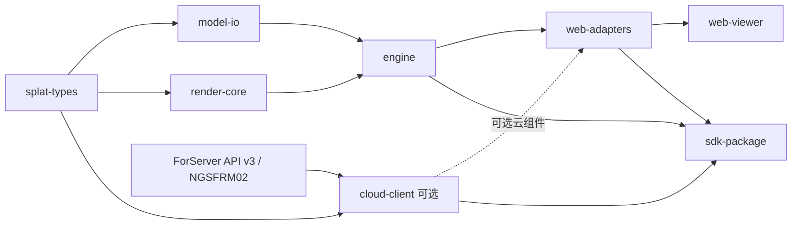

# Web 引擎能力图

状态：用户授权实施的能力边界；2026-10-04。模块ID保持稳定，提供者规格已建立。splat-types/model-io/render-core/engine/web-adapters/web-viewer/sdk-package已实现本地基线；cloud-client为后续独立可选模块，未实现、未导出。完成程度以验收证据为准。

| 模块 ID | 唯一责任与消费者边界 | 依赖 | 后续提供者规格 |
| --- | --- | --- | --- |
| `splat-types` | 规范化场景语义、内部二进制描述、相机/质量/错误值类型 | 无浏览器或框架依赖 | `SPEC-splat-types.md` |
| `model-io` | File/Blob/URL 输入、预检、Worker/WASM 解码、可回退 pthreads 批次、校验、取消；发布完整场景 | `splat-types` | `SPEC-model-io.md` |
| `render-core` | WebGPU 能力、资源准入、上传、全局稳定排序、绘制、诊断 | `splat-types` | `SPEC-render-core.md` |
| `engine` | 加载事务、相机、帧调度、状态/事件、Canvas/设备恢复 | `splat-types`、`model-io`、`render-core` | `SPEC-engine.md` |
| `web-adapters` | React/Vue 绑定、DOM 输入、ResizeObserver 和宿主生命周期；按入口拆包 | `engine`；可选 `cloud-client` | `SPEC-web-adapters.md` |
| `cloud-client` | API v3 租约、NGSFRM02 校验/解码、离散相机、受限图片缓存 | 现有 `ForServer` 提供者契约；公共错误值类型 | `SPEC-cloud-client.md` |
| `web-viewer` | 展示本地/云模式、文件选择、状态与诊断的参考宿主 | `engine`、`web-adapters`、可选 `cloud-client` | `SPEC-web-viewer.md` |
| `sdk-package` | ESM/类型/WASM/Worker 资产、许可证、版本、安装消费验收 | 所有拟发布库；不依赖查看器源码 | `SPEC-sdk-package.md` |

表中“依赖”表示消费者依赖提供者；云客户端不依赖本地 renderer，模型读取不依赖 WebGPU，renderer 不依赖格式解码、HTTP、DOM 输入或 UI 框架。

建议建设顺序：共享语义与兼容性探针 → 解码/渲染最小原型 → 小 PLY 端到端 → 全 SH/稳定排序/SPZ → 事务与恢复 → React/Vue 和独立消费 → 等画质调优与设备验收。云客户端在服务端协议夹具固定后独立建设，进入单独的云模式验收；不阻塞本地渲染链路。

不建立 LoD、编辑、跨模型场景图、WebXR 或 Three.js renderer 桥接模块。新增这些能力时，先修订能力图和相关提供者规格。

preview.3 的线程/资产/API 增量以 [并行解码规格](docs/SPEC-parallel-decoder.md)为准，实测与未验收边界见 [并行报告](docs/verification/pthreads-2026-10-06.md)。

2026-10-06 preview.3: optional `sorting.mode: 'adaptive'` retains full-point
ordering, projects current camera/SH, and rejects currently culled instances on GPU.
Default is adaptive from preview.3; explicit strict preserves the previous sorting behavior. No extra per-point GPU buffer; fresh capture, Y flip,
camera-jump and recovery semantics are specified in
[adaptive sorting contract](docs/SPEC-adaptive-sorting.md). See
[migration](docs/SDK-migration-preview3.md) for additive diagnostics and tradeoffs.
