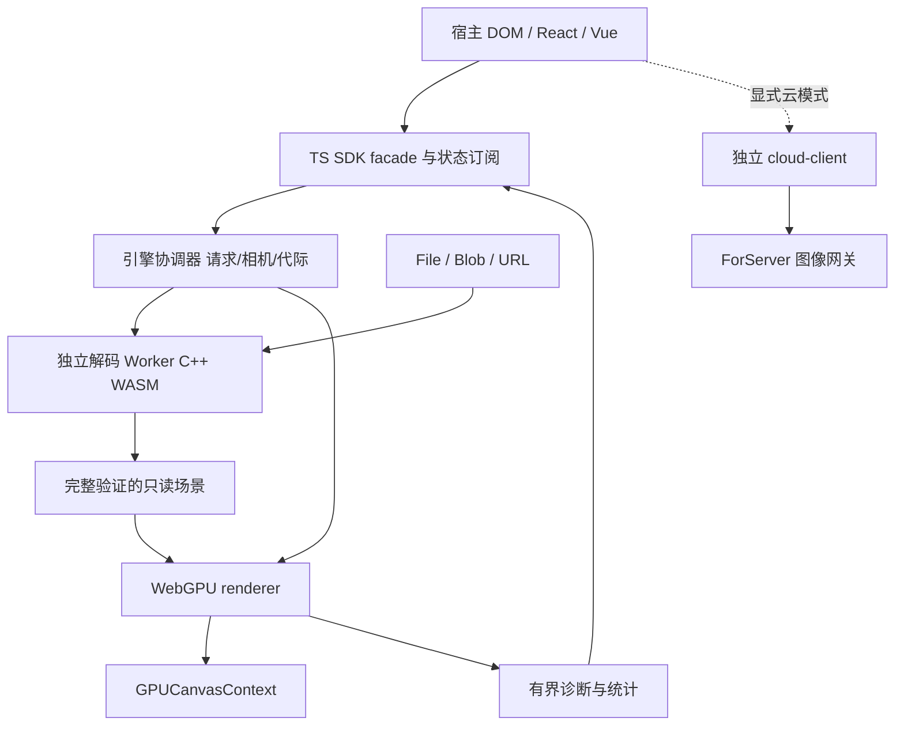

# Native3DGS Web 引擎系统技术设计

状态：架构方案已进入用户授权的实施阶段；2026-10-04。正文保留最初的目标和候选接口，实际0.1.0实现以[ADR-001](decisions/ADR-001-web-implementation-profile.md)、[SDK指南](SDK-guide.md)和[验收证据](verification/implementation-report.md)为准。未实现增强不能作为可用API；模块边界见[能力图](../CAPABILITY-MAP.md)。

2026-10-06 增量：`preview.3` 实现可回退 pthreads 解码，见 [SPEC-parallel-decoder](SPEC-parallel-decoder.md)与[验收报告](verification/pthreads-2026-10-06.md)。采用 `decoder.mode=auto` 能力选择与明确 single/parallel 覆盖；跨源隔离只影响增强解码。渲染 Worker、SIMD 等正文候选路线未因此成为已实现能力。

## 1. 仓库理解与设计约束

### 1.1 现有结构

| 平台 | 源码/测试/契约入口 | 已有设计与证据给出的约束 |
| --- | --- | --- |
| Windows 本地 | `include/splat-types/`、`src/model-io/`、`src/render-core/`、`src/engine/`、`GUI/`；`tests/model-io/`、`tests/render-core/`、`tests/engine/`、`tests/sdk/` | C++20/D3D12；共享只读场景、GPU 排序、异步事务、SDK 独立消费；Spark 画质/整机性能与部分跨厂商门槛仍待验收 |
| Android 本地 | `ForAndroid/` 的七模块规格、原生代码、桥接、GUI、验证记录 | Vulkan/C/JNI/Kotlin；复用根目录 codec 与规范化源码；Surface 代际、首次提交后的 Ready、故障/内存预算必须受测；不能以模拟器证据替代真机 |
| 云渲染 | `ForServer/` 的 CUDA worker、Go gateway、WindowsClient、规格和验证 | 当前 API v3、NGSREQ3 与 NGSFRM02 图像；模型留服务端；单模型实例、租约、离散相机和缓存；`architecture-v1.md` 的 ProjectedSplats 是历史路线 |

依据：[总技术计划](../../docs/technical-development-plan.md)、[Windows 系统设计](../../docs/system-technical-design.md)、[模型规格](../../docs/SPEC-model-io.md)、[渲染规格](../../docs/SPEC-render-core.md)、[引擎 SDK 规格](../../docs/SPEC-engine-sdk.md)、[Android 系统设计](../../ForAndroid/docs/system-technical-design.md)、[云端当前架构](../../ForServer/docs/architecture.md)。验证记录优先用于判断实现状态，不能把历史目标当实测结果。

另有[云端—端侧单帧协同 RFC](../../docs/cloud-edge-single-frame-design.md)提出 ProjectedSplats/ImageFrame/HybridTiles 研究路线，状态为待审提案；它不等于当前 ForServer 的可用服务。Web 首期云集成采用已实现图像协议；将来采用二维高斯/瓦片协同须另审能力图、提供者协议与薄渲染模块，不隐式包含在本轮范围内。

### 1.2 必须沿用的工程规则

- 公共契约归提供者；修改接口、布局、坐标或质量语义，先修改所属规格，再改实现与消费者测试。
- `model-io` 不依赖图形 API；`render-core` 不解析文件、不依赖 UI。TS/WGSL 的布局与 C++/WASM 输出同时版本化、同时验证。
- 场景只读；异步资源以 RequestId、SceneTicket、DeviceGeneration、SurfaceGeneration、ViewportRevision 区分身份。
- 新场景加载失败/取消保留旧活动场景；设备失效等无法继续显示的情形明确发布状态与错误。
- 依赖版本、许可和传递依赖随包分发；不修改 `third_party/` 来绕过问题。Spark 仅作行为参照，授权未厘清的 Rust 源码不复制。
- 固定相机、样本 SHA-256、质量与物理分辨率做图像/性能比较；单测与性能实验分开，保留失败及未测试项。
- 提交采用简短祈使句；PR 链接提供者规格，列出构建、测试、图像与基准证据。

Windows 的现有 MSBuild/CTest、Android 的 CMake/Gradle、Server 的 CTest/Go 检查保持各自工具链。Web 工作流与它们保持相同的契约和验收阶段，不要求浏览器工程使用 MSBuild。

## 2. 目标、首期范围与假设

目标是可供其他网站集成的 3DGS 引擎 SDK；参考查看器用于展示和验证 SDK，不承担核心逻辑。普通 DOM、React、Vue、SSR 框架都能消费相同底层能力。

本轮假设：“ReAct”指 React；桌面优先，移动浏览器另列验收；先支持单模型、完整 SH 0–3 和标准 PLY/SPZ；云图像客户端可选。所有假设均为提议，可在架构审阅中调整。

首期本地能力：File/Blob 和显式 URL 输入；标准 Graphdeco 二进制小端 PLY、基础 SPZ v1–v4；真实阶段进度/取消/错误；轨道、平移、缩放、自由飞行、适配和重置；按需绘制、DPR/尺寸变化；事务替换、设备丢失与关闭；生产 ESM 包及 React/Vue 接入样例。

首期不承诺：压缩 PLY、SPLAT/KSPLAT/SOG/RAD、LoD、SPZ antialiased/未知扩展、SH4、多模型编辑、mesh 深度混合、动画、WebXR、通用 Three.js 场景对象兼容、自动 HTTP Range 渐进解码。Blob 分块读取与上传不等于半模型可见或 LoD 流式显示。

### 2.1 支持策略

| 环境 | 提议支持级别 | 发布门槛 |
| --- | --- | --- |
| 桌面 Chrome/Edge，Windows/macOS/Linux | 首期主路径 | 实际 WebGPU adapter/device、GPU 排序自检、解码/生命周期/图像验收；每 OS 独立记录 |
| 桌面 Firefox/Safari | 首期兼容目标 | 特性探针 + 实机验证；不凭浏览器版本宣称支持 |
| Android Chrome 与 iOS/iPadOS Safari | 后续单列移动验收 | 实机内存、触控、后台、热稳定性及图像/性能；桌面结果不外推 |
| 无 WebGPU、被策略禁用或设备不可用 | 明确 UnsupportedCapability | 可选择独立云图像模式；不静默切换、不下载本地模型尝试软件 GPU |
| 非隔离普通网站 | 基础部署目标 | 单线程 WASM、transfer buffers；不强制 COOP/COEP |
| 跨源隔离网站 | 可选增强 | SIMD/多线程分别探针，线程产物单独验证，不作为基础支持前提 |

WebGPU 需要安全上下文；开发使用 localhost，生产 HTTPS。`navigator.gpu` 存在只是第一层检查，adapter 为空、requestDevice 失败、limits 不足都要产生可解释结果。OffscreenCanvas、Worker 中 WebGPU、Worker rAF 和 SIMD 分别检测，不合成一个“现代浏览器”开关。

## 3. 技术栈、模块与目录

TypeScript 严格模式、直接 WebGPU/WGSL；C++20 经 Emscripten 编译解码与批量规范化；pnpm workspace；Vite 构建示例和 ESM 包；Vitest、GoogleTest、Playwright 分别覆盖 TS、共享 C++、浏览器。React/Vue 是 peerDependencies；具体稳定版本及固定策略见技术基线。

拟议包名使用 `@native3dgs/*`，发布前核实命名空间可用性：

| 包 | 对外内容 | 运行时依赖约束 |
| --- | --- | --- |
| `@native3dgs/web` | `createEngine`、状态/相机/质量/错误类型；可单独安装 | 不依赖 React/Vue/Three.js；内置兼容的解码与渲染包 |
| `@native3dgs/react` | Canvas 组件、hook、状态订阅 | peer：React 与同一 SDK 主版本 |
| `@native3dgs/vue` | Canvas 组件、composable | peer：Vue 与同一 SDK 主版本 |
| `@native3dgs/cloud` | 可选云图像客户端 | 不引入本地模型 codec 或 WebGPU renderer |

内部 `splat-types`、`model-io`、`render-core`、`engine` 首期不单独许诺稳定 npm 插件 ABI；消费者从 `web` 公共 exports 进入。云客户端仅需要公共错误值类型，应拆出轻量类型入口，避免把本地 GPU runtime 带入云包。

```text
ForWeb/
  README.md / CAPABILITY-MAP.md
  docs/                       系统设计、后续 SPEC、ADR、SDK 指南
    verification/             真实验收报告及 evidence 索引
  packages/                   以下目录为拟议，尚未创建
    splat-types/src/
    model-io/src/             输入/Worker/WASM 适配
    model-io/native/          wasm C ABI、Emscripten CMake、输入适配
    render-core/src/          device、resources、passes、layout
    render-core/shaders/      WGSL、稳定排序、绘制与测试内核
    engine/src/               事务、相机、scheduler、snapshot
    web/src/                  SDK facade 与 exports
    react/src/ / vue/src/     轻量框架适配
    cloud/src/                协议、租约、图像和 LRU
  apps/web-viewer/             SDK 参考宿主
  examples/vanilla/ / react/ / vue/ / ssr/
  tests/unit/ / contracts/ / gpu/ / e2e/ / sdk/
  tests/fixtures/              小型合成夹具与外部样本 manifest
  bench/                      时间驱动轨迹、基线、采样工具
  tools/                      WASM 构建、依赖边界、资产及证据检查
  tasks/plan.md / todo.md      审阅通过后生成
  pnpm-workspace.yaml / package.json / pnpm-lock.yaml
```

只有设计文档现已落盘。Web 新实现位于本目录；复用现有平台无关源码需通过显式 CMake source 清单。若必须抽取公共 C++ 核心，先更新原提供者规格，维持现有接口，跑 Windows/Android/Server 相关回归，禁止首期为了 Web 重写原生 GPU 后端。

## 4. 执行拓扑与数据流



### 4.1 基础与增强路径

基础路径：主线程持有 SDK facade、短任务协调器和 WebGPU renderer；解码始终在专用 Worker。rAF 中只提交有界 GPU 命令/输入合并，不跑 SPZ 解压、逐点解析、全量排序、长数组打包或同步等待 GPU。WASM/Worker 初始化按需异步，不在模块顶层触碰 `window`、Canvas、GPU 或网络。

增强路径：宿主在转移 Canvas 前，通过临时 Worker 探针确认 Worker WebGPU + OffscreenCanvas WebGPU context 可用，然后将 Canvas 一次性转移给渲染 Worker；facade 留主线程。失败发生在已转移之后时，原 HTMLCanvasElement 不能作为普通 Canvas 自动回收，SDK 发出 `SurfaceReplacementRequired`，宿主创建新 Canvas。Worker rAF 不可用但 Worker WebGPU 可用时由主线程发带时间戳的 frame tick，只保留一个待处理 tick。

`execution: 'auto' | 'main' | 'worker'` 是拟议选项。`auto` 根据完整探针决定路径，公开 `selectedExecution` 和能力报告；两条路径共享 renderer 和测试语义，不能只有一条路径通过验收。

每实例一个解码 Worker，至多一个运行和一个最新待启动加载；渲染 Worker 可选。多视口不共享活动相机、请求、Canvas 或事件队列。首期每实例自有 device，不承诺跨实例资源池；并发实例数受宿主总预算限制。

### 4.2 Worker 消息与背压

消息头带协议版本、requestId、ticket、deviceGeneration、surfaceGeneration 和消息序号；命令采用可辨识 union。队列设总条数/字节预算，相机/resize 合并为最新值；状态/进度可合并，Promise 终态必须恰好交付一次。观察事件队列有界，丢弃计数公开，关键状态始终可从快照恢复。

大数据使用 ArrayBuffer transfer list，交付后发送方视图失效；接收者验证长度、偏移、元数据及所声明布局，不逐 splat postMessage。SharedArrayBuffer 不是基础路径。WASM memory 不能被当成普通可转移 ArrayBuffer；完成后向独立输出块复制，再转移给 renderer。页面上传与队列采用 credit/ack 控制，不能把全部场景转换成无限待上传消息。

## 5. 共享数据、WASM 与输入边界

### 5.1 规范化场景

沿用 `include/splat-types/scene.h` 的语义：RUB 右手、+Y 上、相机局部 -Z；double 世界原点/中心 bounds/maxScale；float32 局部中心、正尺度、xyzw 单位四元数、opacity、训练色值域 `rgb0`、实际 SH0–3。SH 为系数优先、RGB 相邻，`rgb0 = 0.5 + C0 * f_dc`，不在解码器提前 clamp 或做 gamma。

TS Number 用于 float64 元数据与相机，转 GPU 前在 CPU 求世界位置与原点之差。二进制传输头包含版本、总字节、count、SH 阶数、各段 offset/length、源格式、坐标标识；用 DataView 明确 little-endian，不把 C++ struct 的 padding 当 JS 协议。外部 u64 使用 BigInt/DataView 读取并受检；进入 Number/wasm32 前校验可精确表示、实际数组上限和指针范围。

基础 SoA 每点为 `56 + 12 * ((degree + 1)^2 - 1)` 字节，SH3 为 236 字节；不含头部、对齐、输入压缩流和第三方临时 cloud。只读是内部所有权契约，JS TypedArray 本身并不不可变；公开 SDK 不暴露活动场景的可写视图。取消/转移/释放后的视图不得继续被缓存。

### 5.2 复用与 C ABI

已检查 `src/model-io/common/probe.*`、`normalize/normalize.*`、`codecs/decode.*`：Android 已复用这些源码；Windows 进程/映射包装另在 client/helper 层。WASM 复用预检和规范化算法，新的输入/输出适配位于 `ForWeb/packages/model-io/native/`。`FILE*` 读取、callback 和 SceneHeader 内部耦合需适配/小范围抽取，不能把现有 loader 整体编译并假设 Win32 Job/共享映射可用。

拟议私有 ABI：版本查询、预检、创建上下文、分块输入/解码、取进度、取输出段、错误查询、取消、释放。句柄和指针由模块管理；边界只批量传缓冲及 POD，异常捕获为稳定错误码；不跨 ABI 传 STL、JS 对象或 C++ 异常。ABI 布局版本、WASM 哈希、wrapper 版本不匹配时初始化失败。相机的小量数学留 TS，逐点规范化和必要 GPU 打包在 WASM/Worker 批处理。

GPU 打包代码和布局由 render-core 提供，作为单独批量 kernel/Worker 任务消费规范化场景；它不能进入 model-io 的公共契约，也不能让格式解码器知道 WGSL buffer 布局。

基础 WASM：wasm32、单线程、明确最大线性内存；禁止无限增长和整文件 MEMFS 镜像。SIMD 单独探针并提供 scalar 产物；内存增长后旧 JS 视图重建。多线程产物需宿主明确开启且 `crossOriginIsolated`/SharedArrayBuffer 可用；与基础产物分开发布和验收。WASM64、WebGPU subgroup/f16 不作为首期硬要求。

### 5.3 File/Blob/URL

- Blob/File 用 slice/stream 分块读取，PLY 头最多 64 KiB、约 4 MiB 批次作为初始调优值；属性表与大小先受检，保留 PLY 属性重排与额外标量语义。
- 默认 PLY RDF→RUB，允许调用者明确指定 RUB；中心、四元数和方向 SH 同步转换。不增加猜测式 Auto。
- SPZ v1–v3 gzip 与 v4 NGSP/TOC 按现有版本规则预检；第三方完整 cloud 的输入/临时/规范化输出峰值计入预算。不能声称 SPZ 已实现恒定内存流式解码。
- URL 通过 fetch + AbortController + ReadableStream，限制重定向、协议、字节数、超时和解码后声明。Content-Length 可为空或不可信，以累计实际字节校验；CORS、拒绝访问、断流分别产生稳定错误。
- 默认 HTTPS，开发 localhost；认证由宿主提供 request hook/短期凭据，不记录请求头、token 或完整 URL。自定义 fetch hook 要遵守取消和体积预算。
- 初次拒绝 ASCII/大端/压缩 PLY、非法或不完整 SH、未知 SPZ flags、SH4、antialiased 扩展。兼容性由合成/真实样本固定，不按扩展名决定 codec。

Worker watchdog 对预检、解码、无进度和总耗时分别设预算。SPZ 阻塞调用不能靠同 Worker 的取消消息立即响应，取消/替换时可终止整个解码 Worker，释放其 WASM 状态，再创建新 Worker；PLY 支持批次间协作取消。浏览器不给 Worker 独立硬 RAM 配额，终止也不能保证挽救已发生的整页 OOM；因此声明预算检查是必需防线，不把 Worker/WASM 称为原生进程资源沙箱。

## 6. WebGPU renderer 与帧图

### 6.1 能力和 GPU 布局

初始化检测实际 limits：maxBufferSize、maxStorageBufferBindingSize、maxStorageBuffersPerShaderStage、maxBindingsPerBindGroup、工作组线程/存储/维度、纹理尺寸和 uniform 对齐；只申请确实需要的 limits/features。timestamp-query、subgroups、shader-f16、indirect-first-instance 都是可选能力，不作为基础渲染条件。

GPU 布局由 render-core 私有定义并生成 TS/C++/WGSL 常量与读回测试。首期保留 float32，采用 raw `array<u32>` 读取 bitcast 标量，避免 WGSL vec3 对齐和 C++ 紧密结构混用。拟议每点基块 64 字节：center/padding、scale/padding、xyzw rotation、rgb0/opacity 各 16 字节；SH 余项每系数 3 个 scalar float32，整记录 16 字节补齐，SH0/1/2/3 stride 为 64/112/160/256 字节。

上传前根据实际 device binding 上限与 stride 算页容量。基础 draw 变体最多四个场景页、一个全局排序索引 storage binding；其他元数据使用 uniform。索引和 scratch 也独立校验 buffer/binding 限制。缺页绑定小型安全 dummy buffer。顶点按全局原始索引计算 page/local index，在 shader 中选择正确页；整个场景按同一个排序索引进行一次有序实例绘制，**不能按场景页分别 draw 再拼接**，否则会破坏透明顺序。

以常见 128 MiB storage binding 上限作说明，SH3 每页最多 524,288 点，四页最多 2,097,152 点；这只是布局上限示例，未考虑 RAM/GPU 预算，不是模型支持承诺。设备能力允许更多页时可用经过测试的更高页数变体，并核查绑定限制/着色器成本；首期超出已验证变体明确 ResourceLimit，不静默少画点，也不以分段绘制代替全局排序。需要更大场景时另立分页/量化/LoD 方案。

### 6.2 正确性基线帧图

```text
最新有效相机/场景/尺寸
  → 分页候选投影与径向排序键（保守椭圆裁剪）
  → 分工作组直方图 → 分层前缀扫描 → 稳定 scatter
  → 八次 4-bit LSD radix 得全局 key/index
  → GPU 写 drawIndirect 参数（firstInstance = 0）
  → 4 顶点 triangle-strip 实例化 Gaussian quad
  → 实际 SH 求值、Gaussian、预乘 alpha 合成
  → GPUCanvasContext 当前纹理
```

不在普通帧将可见集/排序读回 CPU。默认从远到近径向距离平方，视深度仅作显式诊断模式；有限非负 float32 单调键编码，保留不可见 sentinel，避免零距离与 sentinel 冲突；同键保留原始点序。每帧重新从原始顺序初始化 key/index，避免排序输入受到上一帧顺序影响。

稳定 scatter 使用工作组内稳定局部 rank + 各 bin/workgroup 的确定前缀；禁止用无序全局 atomic append 分配同键位置。基本版本使用工作组共享内存/多 pass 扫描，支持 0/1、全同键、尾块、非二次幂、多页和大数量。不假设 subgroup 宽度，不直接翻译 HLSL WaveOps。最小设备实际工作组能力决定 128/256 等已验证变体，每层 dispatch 校验上限，必要时二维调度。启动时在 GPU 排序小型已知序列并异步读回自检；失败拒绝 renderer 初始化。

不先无序压缩可见点再稳定排序；基线维持原始索引和 sentinel 排序。GPU 计数供 drawIndirect 使用。后续紧凑化须保持稳定顺序并有独立成本证据。

### 6.3 投影、SH、颜色

协方差 `Sigma3 = R diag(scale^2) R^T`，经透视 Jacobian 得屏幕 Sigma2；保留稳定小特征值计算以避免强各向异性消减误差。裁剪考虑 Gaussian 支撑和近面交叉，不只检测中心；NaN、非法投影或不正定结果逐点拒绝并计数。相机深度 `[0,1]`，GPU viewport/Y 映射及截图方向以夹具校验，不照搬 GL 翻转。

使用同一实际 SH 阶数、相机相对方向、符号/通道顺序、clamp 时机、maxStddev、minAlpha、covarianceBlur 和像素半径配置。四顶点 strip 保持两三角 quad 支撑，禁深度写入；RGB/alpha 合成为 `one / one-minus-src-alpha`。内部默认显示编码训练色值域，与现有 Windows 锁定行为对照；Canvas 使用 sRGB 色域与优先格式的 UNORM 路线，不额外叠加 sRGB texture 转换。透明宿主时 alphaMode= premultiplied，背景为透明黑；不透明模式显式配置。

M0 必须用色条、半透明叠加和实际浏览器截图确认编码/alpha，无条件写“线性空间更正确”会改变现有对照。格式、alpha/colorSpace、背景、shader 哈希全部进入质量 manifest。默认完整点数、完整 SH、无 LoD。低内存模式只有宿主显式允许后才能降低 SH/抽样，并公开源/实际点数和降级原因；另列图像/性能数据，不能进入等画质成绩。

### 6.4 上传、排序复用与计时

增量上传使用有界 staging/writeBuffer 页，初始 page 目标 4–16 MiB，经实测选值；CPU packing、queue 写入、GPU 完成分别计数，不能把 memcpy 当上传完成。writeBuffer 复制后可以回收输入页；明确 transfer 与 GPU 工作的不同生命周期。至多 2–3 帧在途，resource retire 以应用 submission serial + queue.onSubmittedWorkDone 等完成信号维护；正常帧不 await 全队列。

scene/camera/surface/viewport/quality revision 全部一致才复用候选/排序；静止时按需绘制，不用重复空帧刷高 FPS。继续运动、自由飞行、DPR/尺寸与质量变化按实际依赖触发更新；基准分别报告静止与持续移动。

timestamp-query 可用时采用有界查询/readback ring，resolve 后 mapAsync 异步读取，字段带提交号与可用性；缺失时填 null，不用 CPU submit 时长替代 GPU 时间。统计发布低频（建议 4 Hz），不每帧同步日志/响应式更新。

## 7. 内存准入与资源生命周期

WebGPU 不提供 DXGI/Vulkan 式可靠剩余显存或 residency 预算。`device.limits` 是尺寸/数量限制，不是空闲容量；navigator.deviceMemory 是粗粒度提示，不是可分配 RAM。宿主配置 CPU/GPU/input 上限，引擎追踪自有分配，实际分配/error scope/device loss 始终兜底。

准入估算至少为：

```text
CPU peak = 旧保留场景 + 输入暂存 + WASM heap 高水位
         + 第三方临时 cloud + 新规范化/transfer 块 + GPU 打包页 + 恢复副本
GPU peak = 旧活动场景及 scratch + 新场景页及 scratch
         + 新旧 viewport 目标 + 在途帧/查询 + staging
```

WASM heap 高水位已含其中分配时不能重复计费；估算工具同时列出按分配域的明细和实测峰值。SoA→GPU 复制、旧/新场景同时驻留、终止 Worker 后回收延迟都算在事务峰值里，不能只乘“每点 GPU 字节”。

M0 桌面起始 policy 提议：输入上限 256 MiB、每解码 Worker WASM 最大内存 1 GiB、实例 CPU 估算峰值 1.5 GiB、实例 GPU 自有预算 512 MiB，取各资源/设备约束最小值。这些是保守可配置上限，不是浏览器可用内存承诺；单配置可被宿主收紧，放宽需新验收 profile。移动端另定更低实测 profile，不继承桌面预算。

模型预检即可判断数量/SH/声明字节的，提前拒绝；未知解压尺寸在累计输出中持续限制。先 allocate 新资源，error scope 捕获 validation/out-of-memory，完成首帧提交后才激活；任何失败释放待命资源并保留仍健康的旧活动资源。无可靠预算时不循环试探直到页面崩溃。

renderer 持有活动 CPU 场景用于设备恢复；`recoveryPolicy: 'retain' | 'reload' | 'none'` 为拟议选项。默认 retain 计入 CPU 预算；reload 需可重复读取的 Blob/URL，URL 内容哈希变化视为新加载事务；none 在 device loss 后进入需重新打开状态。不同时保留两份“只为保险”的全量 CPU 副本。

## 8. 引擎事务、Canvas 与设备恢复

### 8.1 状态与完成语义

状态包含 Initializing、Idle、Loading、Uploading、Ready、Suspended、Recovering、Faulted、Stopping、Stopped。加载进度与活动场景分开表达，Loading 时旧场景可以仍然可见。generation/revision 是不同身份，不用一个递增数混用。

`open` 立即返回带 requestId、cancel 和 result Promise 的 LoadOperation。仅最新有效请求可提交；预检/解码成功不代表活动场景已替换。新场景 fit、上传、自检/排序与首帧命令成功提交，并收到其 GPU 完成及无相关错误后，在协调器提交场景与相机/重置基线，resolve result。取消/失败只结束待命工作；closeScene 取消待命并清活动场景，是独立操作。

WebGPU 没有跨浏览器可靠“用户已经看见这一帧”的 Present 完成回调。SDK 的 Ready 明确指 **RenderReady：首个目标帧已完成 GPU 工作且已交给有效 Canvas**，不承诺物理显示器扫描输出；事件记录 frameId/submission/surface generation。GPU 完成测试和浏览器截图/人工呈现测试分别记录，不将 queue Promise 描述成真实 Present。事务期间提交失败可以回滚健康旧场景；device loss 不承诺保留旧画面。

旧活动相机只在新请求成功后替换；取消、无效 fit 保持旧相机。世界输入以明确像素/秒和时间戳，JS float64 数学；resize 不改变姿态，fit 才重新计算距离。fit 包含中心 bounds + Gaussian 支撑、较小 FOV 和余量。轴镜像、屏幕输入与云 flipY 是不同契约，不共用布尔值偷换语义。

### 8.2 Canvas/页面生命周期

宿主拥有 HTMLCanvasElement 和 DOM 布局，引擎拥有 GPUCanvasContext 配置及内部资源；不接受宿主外部 GPUDevice 作为首期稳定 API。attach/detach/resize 带 surface generation 和 viewport revision。Canvas 纹理每帧获取，不跨帧缓存 currentTexture。resize 根据 CSS 尺寸×明确 pixelRatio 得物理像素；公开真实尺寸，不默认把 DPR 限制隐藏在 renderer。

尺寸为零、不可见或页面 hidden 时暂停帧调度，保留可预算场景；重新可见时确认尺寸/设备并刷新相机。blur、pointercancel、失去 pointer lock 清连续输入；pointer capture 释放、ResizeObserver/visibility 监听及订阅都必须可拆除。核心不创建全局键鼠监听。

detach 先停止 Canvas 提交、完成/废弃相关提交，然后 unconfigure；普通 detach 不销毁场景。转移 Canvas 的 Worker 意外终止时发布需新 Canvas 状态；不在卸载组件中复用已转移 Canvas。

### 8.3 Device loss、停止与故障

监听 device.lost 和 uncapturederror，error scope 按资源创建/提交阶段成对维护；缺失 shader entry、异步 pipeline 失败、OOM、GPU 自检失败分别归类。loss 后暂停 GPU 工作、使旧 device generation 失效，旧 queue 的等待只能有界处理，不能无限 await。

拟议最多两次自动设备重建，按短退避再 requestAdapter/device，重新核对能力/预算并自检、重传活动 CPU 场景；恢复完成遵循 RenderReady。尺寸/Canvas 代际改变时只使用当前宿主表面；恢复失败进入 Faulted，提供显式 retry 或 dispose/recreate。由主动 dispose 引发的 destroyed loss 不启动恢复。

dispose 幂等且异步：禁止新命令 → 取消解码/网络 → 停 tick/输入 → 完成或故障废弃 GPU 在途资源 → detach → 清 buffers/Worker/订阅 → Stopped。迟到 callback 不重新激活状态。关闭有上限和结构化 timeout 结果，不让 UI 同步等待 GPU；浏览器 unload 不能保证异步销毁完成。

| 故障 | 最终行为 | 验证重点 |
| --- | --- | --- |
| 无 WebGPU / adapter / 所需 limits | 能力错误，宿主仍可交互 | 无 GPU 配置与实际受限设备 |
| 损坏/超限/Worker trap/timeout | 当前请求失败、旧模型保持、Worker 可重建 | 合成坏输入和终止注入 |
| 分配/上传/首帧 validation 失败 | 释放新资源并回滚；若 device loss 则进入恢复 | 每阶段注入，不只测 open 方法返回 |
| 过期相机/resize/加载消息 | 丢弃，计数，不覆盖当前快照 | 新旧请求、Canvas、device 三类竞态 |
| 后台/零尺寸/卸载 | 暂停或幂等释放，恢复只用当前代际 | 100 次可见性/挂载与卸载 |
| device loss / Worker 渲染崩溃 | 有界恢复或明确 Faulted/需换 Canvas | 注入 + 实机驱动情形分开记录 |

## 9. SDK 形状与框架集成

以下是架构讨论用 API 形状，正式字段/错误枚举及方法合同归后续 `engine`、`web-adapters` 提供者规格。

```ts
import { createEngine } from '@native3dgs/web';

const initialized = await createEngine({
    canvas,
    execution: 'auto',
    quality: { profile: 'full' },
    assets: { baseUrl: new URL('/native3dgs/', location.origin) },
});

// 示例位于异步宿主初始化函数中；初始化失败由宿主显示错误。
if (!initialized.ok) {
    showInitializationError(initialized.error.code);
    return;
}
const engine = initialized.value;
const operation = engine.open({ kind: 'blob', blob: file, plyCoordinates: 'rdf' });
const outcome = await operation.result; // 可辨识 Result：成功或稳定 EngineError
if (!outcome.ok) {
    showLoadError(outcome.error.code);
}

engine.camera.orbit({ deltaX: 12, deltaY: 4, unit: 'physical-pixel' });
const unsubscribe = engine.subscribe(() => updateStatus(engine.getSnapshot()));
// 宿主卸载时：
unsubscribe();
await engine.dispose();
```

错误统一为 Result/结构化异步终态，环境错误不混用 null/裸字符串/第三方异常；加载终态最多一次。API 错误至少包含 code、stage、requestId、recoverable、限长 diagnostic；无总字节/时间戳能力时明确 null，不伪造百分比。用户 observer 抛异常在订阅分发边界隔离，不能破坏 renderer 或阻止其他订阅者。

getSnapshot 返回稳定只读对象：无变化时保持同一引用，变化后生成新快照；include phase/active source id、request/ticket/generation、进度、质量变化和 nullable stats。相机操作返回校验结果，非法数值不改变有效相机。错误码属于公开兼容契约，诊断字符串不用于程序判断。

### 9.1 React 与 Vue

- React：`useNative3DGS` 管理实例；useSyncExternalStore 订阅稳定快照；初始化异步 generation guard 防止卸载后回调。StrictMode setup/cleanup/setup 必须可重复；每次转移路径创建独立 Canvas，异步 dispose 不影响新实例。不把 scene typed arrays 放组件状态。
- Vue：`useNative3DGS` + shallowRef/markRaw 持有实例，onMounted 初始化、onBeforeUnmount 停输入/发销毁；状态浅订阅，GPU 对象不经深响应式代理。watch 源变化使用 operation.cancel 和请求身份过滤。
- SSR：import 包不访问浏览器 globals、不创建 Worker/下载 WASM；server snapshot 为明确未初始化值。客户端 mount 后动态初始化，示例覆盖 React SSR 和 Vue SSR。渲染核心没有服务端 SSR 绘图承诺。
- DOM 适配：ResizeObserver 和 pixelRatio 由适配器统一算物理尺寸；拖拽/滚轮/pointer lock 可选，不抢全局焦点或网站滚动。输入焦点与镜像按未变换屏幕坐标处理。

主包提供编程 API，适配包仅组装生命周期。core/React/Vue 的独立安装消费测试证明“可集成”，不能只证明 monorepo 查看器能运行。未来嵌入 Three.js/Babylon 时另设计外部 GPUDevice、render target、深度与透明合成契约，首期采用独立 Canvas 叠层。

### 9.2 资产与打包

ESM + d.ts、明确 exports、框架 external/peerDependencies、仅对实际无副作用模块标 sideEffects=false。WASM/Worker 含内容哈希，由 manifest 与 wrapper 校验；不得固定 localhost、仓库相对路径或隐式 CDN。提供默认模块相对资产解析、显式 baseUrl，以及严格 CSP 下自托管 Worker URL/WASM URL 或宿主 worker factory 的覆盖方式。

生产支持子路径和跨源 CDN（需适当 CORS/CORP）；`.wasm` MIME 为 application/wasm，instantiateStreaming 在响应 MIME 不匹配等受控场景回落到 ArrayBuffer 实例化。CSP 说明 worker-src/script-src/connect-src 与 wasm 编译策略；不要求 unsafe-eval 或 blob Worker 作为唯一启动方法。基础版本无 COOP/COEP 要求，多线程增强另给部署说明，不能使普通嵌入网站失效。

SDK tarball 包含 license/第三方 notices、依赖版本、资产哈希、API 文档和独立消费示例；不打包外部真实模型、私网地址、token、原始日志或 benchmark 大文件。

## 10. 可选云图像客户端

遵循现有 [API v3 实例缓存契约](../../ForServer/docs/SPEC-instances-cache-v3.md)与[图像包契约](../../ForServer/docs/SPEC-image-frame.md)。不增加新服务端渲染管线，不使用历史二维 Gaussian 下载协议。

客户端处理 /health、/models、/sessions、心跳/close 和 /frame；解析 NGSFRM02 的 64 字节小端 header、版本、保留位、长度、尺寸、profile、header/payload CRC32；先校验再分配/解压。JPEG 使用浏览器 ImageBitmap 等图像解码，RGBA/raw 直接处理，Zstd 使用独立小 WASM 产物；云包不为 Zstd 引入完整本地 codec。JPEG 解码颜色容差单列，raw RGBA 逐字节对照。

相机复用服务端 2°方位/极角网格、81 档对数距离和极点 roll 规则；云 flipY 表示相机 up/right 反转，不能映射成模型镜像。保留完整视图/版本/分辨率/质量 cache key；前台 latest-wins/single-flight，预取单独有界任务、优先级低于前台，压缩 LRU 初始上限沿用 64 MiB，解码图片占用另计。

会话 120 秒租约/10 秒心跳是协议策略，但后台浏览器 timer 会节流，不能保证永久保活；hidden 时暂停预取，回前台核验/重建会话，410 清本地版本缓存并重新请求。控制操作短超时/有限重试；会话创建若结果未知，不能假设安全重试不会生成额外租约，依赖旧租约过期并有界处理。帧取消不取消其他用户共享的服务端 producer。

当前网关与 Windows Client 认证不等于可直接供公网站前端使用。浏览器集成首选同源 BFF/反向代理：管理 bearer 仅服务端保存，前端用网站会话/短期授权。跨源直连需部署受限 origin 的 CORS，允许实际 Authorization/X-GS-* 请求头、暴露身份/缓存/统计响应头并验证 OPTIONS；不能默认为现有网关已具备这些条件，也不能使用通配 credential 策略。

公网部署要求 HTTPS、网站用户到模型访问权限映射和服务端授权验收；当前共享管理 token 不嵌入静态 JS/localStorage。可信私网 HTTP 的 Windows 例外不能直接继承到 HTTPS 网页（mixed content）。本地失败后是否进入云模式由用户/宿主明确选择，服务端模型选择与本地文件为不同来源，禁止自动上传。

## 11. 风格、开发命令与工作流

TS 使用四空格、PascalCase 类型、camelCase 函数/变量；strict、noUncheckedIndexedAccess、exactOptionalPropertyTypes，禁止 any 掩盖边界；switch 对 union 做穷尽校验。C++20 保持仓库 snake_case 规则，WGSL shader 与 host 布局使用同一生成常量。错误/所有权注释说明原因，不复制算法步骤作为大段注释。

API/数据边界验证外部输入；内部数学函数使用受测不变量。C++ 使用受检整数/RAII；没有 clang-format 锁定配置前不对现有原生文件做大规模格式改动。TS formatter/lint 和依赖边界脚本进入质量门。

以下是 **实施阶段必须提供的脚本合同，目前尚不能执行**。从仓库根目录使用固定 Node/pnpm，emsdk 环境由 build:wasm 明确检查；不通过文档命令暗中安装全局工具或改原生构建。

```powershell
pnpm --dir ForWeb install --frozen-lockfile
pnpm --dir ForWeb run build:wasm -- --profile release
pnpm --dir ForWeb run typecheck
pnpm --dir ForWeb run lint
pnpm --dir ForWeb run check:boundaries
pnpm --dir ForWeb run test:unit -- --run
pnpm --dir ForWeb run test:contracts -- --run
pnpm --dir ForWeb run build
pnpm --dir ForWeb exec playwright install chromium firefox webkit
pnpm --dir ForWeb run test:e2e -- --project chromium
pnpm --dir ForWeb run test:gpu -- --browser chrome --adapter hardware
pnpm --dir ForWeb run test:sdk -- --framework vanilla --framework react --framework vue --ssr
pnpm --dir ForWeb run bench -- --profile full --width 1920 --height 1080 --warmup-seconds 30 --sample-seconds 60 --repeats 3
pnpm --dir ForWeb run dev -- --host 127.0.0.1
```

基准样本路径来自开发者本地配置或参数，manifest 固定 SHA-256；不预设工作区每台机器都有父目录样本。`test:gpu --adapter hardware` 无实际硬件时返回未通过门槛，不能 mock 或 silent skip 得绿色发布结果。Playwright 浏览器下载与 GPU 使用不作为本轮文档工作的操作。

Always：先更新提供者契约、保持模块边界、固定依赖、测试失败即保留证据、shader 改动跑图像/排序测试、性能结论附等画质条件。需先审阅的变更：新增首期之外能力、公开 ABI/坐标/质量变化、放宽资源 profile、采用新 GPU 算法或跨平台共享核心抽取。Never：静默裁点/SH、禁用失败测试、提交凭据/无授权模型、用软件 GPU 冒充硬件成绩、复写原生引擎接口绕过 Web 限制。

审阅步骤只针对新边界/范围改变；已有授权范围内的实现、修复、测试无需反复申请。Git 分支默认 `codex/` 前缀，提交/PR 按根仓库规则。

## 12. 测试、CI 与证据

| 层级 | 工具/目录 | 必须验证 |
| --- | --- | --- |
| 共享 C++ | GoogleTest + sanitizer，native 主机测试 | PLY/SPZ 规范化、坐标/SH、坏头/边界/溢出，与既有平台数据相容 |
| WASM 边界 | 浏览器/Node 支持的实际 WASM，contracts | scalar/SIMD 输出、内存增长视图、ABI 版本、trap/OOM/取消/释放、输出字节与原生对照 |
| TS CPU | Vitest，unit | 相机/fit/远原点、请求替换、消息协议、预算、状态机、错误、订阅与迟到回调 |
| GPU 排序/数学 | 实际 WebGPU + 受控 readback，gpu | CPU stable_sort 对照；全同键、sentinel、边界/尾块、多页、投影/SH/透明与异常点 |
| 浏览器流程 | Playwright + 实体浏览器，e2e | File/URL/CORS、取消、Worker 崩溃、resize/DPR、零尺寸/hidden、pointer lock、device loss 注入 |
| 框架/SSR | Vitest + Playwright + 外部消费 | React StrictMode、Vue mount/unmount/watch、双视口、SSR import、订阅泄漏和已转移 Canvas |
| SDK 安装消费 | pack/tarball + 独立目录安装，sdk | 无 workspace link、无源码路径，资产子路径/CDN/CSP、vite/SSR、完整许可和版本 |
| 云协议 | 合成/服务端金样本 + 有界 mock + 实际网关 | 包字段/CRC/解压弹、401/410/503、BFF/CORS、租约节流恢复、视角/缓存与取消 |
| 性能/长稳 | Release 实机，bench | 等画质相机路径、加载/交互/内存、后台/替换循环、跨 GPU/移动热状态 |

GPU 金样本不能只测“画面非空”：合成 SH 每个基项/坐标、重叠半透明、近面交叉、大半径边缘、极端各向异性与远原点逐项检查。小夹具用可解释的 float/RGBA 容差；真实样本计算 SSIM、误差热图并人工检查缺块/排序/黑边。

CI 分层：普通 PR 跑类型/lint/边界/CPU/WASM/SSR/打包；实际硬件 runner 跑 WebGPU 自检/图像/流程；Release 需通过硬件矩阵、独立安装消费和性能报告。软件 adapter 可用于 validation smoke，但必须标注；若 CI 无 GPU，该层标“未验收”，发布流程不能把跳过视为通过。Playwright WebKit 不替代真实 Safari，device loss 注入不替代所有驱动故障。

不设置凭空数值覆盖率目标；以必需场景矩阵/状态终态/错误分支覆盖作为门槛，覆盖率用于发现缺口。原生共享核心有修改才执行相关原生回归；纯 Web 文档无需重建 Windows、Android 或部署 Server。

证据落在 `ForWeb/docs/verification/`：环境/设备/驱动/浏览器版本、adapter 特性/limits、WASM/WGSL/build 哈希、源样本许可/SHA-256/count/SH、质量 manifest、相机轨迹、命令、原始 CSV/JSON、截图/热图、测试跳过及失败原因。大文件可外部存储，索引记录哈希和可获取地址。默认日志不记完整 URL、token、路径、模型内容，不逐帧写盘。

## 13. 性能目标与优化协议

### 13.1 比较对象与测量

主外部基线是当前工作区 Spark 2.1 Web Viewer，具体 commit/依赖/质量在 M0 锁定；本项目 Windows D3D12 和云 CUDA 结果只作机制/诊断参照，不与浏览器 FPS 混为同一比赛。真实 PLY/SPZ 样本沿用小/中/大 manifest；过大样本被 profile 拒绝时报告拒绝，不用裁点后的结果冒充完整质量成绩。

主验收以 RTX 3080 + 同浏览器/OS/驱动/电源、1920×1080 物理像素、完整相同 SH/点数/排序/颜色/Gaussian 质量、同时间驱动路径进行；静止和持续运动分组，30 秒预热、60 秒采样、至少 3 次。每次输出中位帧时间、p95/p99、最慢 1% 平均帧时间倒数定义的 1% low FPS，最后报告三轮中位值。

浏览器 rAF/合成通常受刷新率限制，没有可移植“关闭 VSync”承诺；rAF interval 是调度/用户可见节奏代理，不是精确扫描输出时间。若双方都锁在刷新周期，标记呈现受限，不能依据相同 16.7 ms 宣称提速。额外的离屏不节流 GPU benchmark 只作阶段诊断，明确排除 DOM/合成，不能替代主成绩。

### 13.2 提议验收门槛

| 项目 | 目标/规则 | 当前状态 |
| --- | --- | --- |
| 真实样本图像 | 对齐基线每固定视角 SSIM ≥ 0.95；合成数学/像素夹具及局部缺陷检查同时通过 | 未测试 |
| 等画质性能 | 每个可比较主场景 median ≤ 0.80×Spark Web 基线、1% low ≥ 基线；呈现受限场景判不可定 | 提议沿用 Windows 的改善目标，待 M0 可测性确认 |
| 无退化门槛 | 无法获得未节流主比较时，仍须报告加载/交互及 GPU 阶段数据，不能宣布 20% 目标通过 | 未测试 |
| 主线程响应 | 正常加载/操作中由引擎归因的长任务不得超过 50 ms；任务观测不支持时用浏览器 trace 替代 | 提议，待实测 |
| 取消反馈 | cancel 后 100 ms 内进入取消中；受控测试 2 s 内终态，旧模型保留；OS/网络/GPU异常单列 | 提议，待实测 |
| 稳定性 | 100 次替换/取消/挂载卸载、30 分钟持续浏览，无未处理异常或自有资源持续增长 | 未测试 |
| 兼容性 | 至少 NVIDIA 独显、AMD 独显、Intel UMA，以及 Safari/Apple GPU 独立记录；缺设备标未测试 | 未测试 |

这些门槛是待审阅/待验证的质量合同，实施中不能悄悄下调。GPU 自有分配计数可精确追踪，真实浏览器总内存/显存未必可测；不报告不存在的 WebGPU 显存 API 数字。加载首帧/完整上传、CPU/Worker heap、高水位估算及 GPU 阶段分开记录，first input→目标帧完成及截图呈现证据区分。

### 13.3 调优顺序

1. 建立正确画面与全 SH/稳定排序基线，先定位解码、packing/transfer、上传、投影、排序、draw/overdraw 的占比。
2. 减少整场景复制，PLY 分块写规范化输出；SPZ 临时 cloud 的重复数据释放时机受测；SIMD 只在同输出/峰值预算下评估。
3. 调整上传页、工作组大小、radix scan 分层、buffer 访问和 SH 固定阶变体；不把 RTX 的最佳组数推广到所有 GPU。
4. 评估预投影缓存对重复顶点 SH/协方差运算的收益与额外内存；按静止/移动两组测，防止只优化排序复用样本。
5. subgroups、f16、量化、压缩 GPU 布局和紧凑化各建独立实验开关；图像/稳定排序回归先通过，再记录胜出/失败决定。

优化提交附 before/after 同条件数据；关闭 SH、降分辨率、降低支撑、抽样或 LoD 属于质量 profile 改变，不算算法优化通过。功能/图像门槛失败时停止性能胜出判断。

## 14. 建设阶段、风险与待定项

以下为架构检查点，不是已批准的实施任务清单或工期承诺。

| 阶段 | 可审阅成果 | 继续条件 |
| --- | --- | --- |
| A0 架构/能力图 | 本设计、边界与目标 | 审阅范围/模块图；之后逐模块 SPEC |
| M0 路线验证 | 固定工具链、WASM decode、WebGPU triangle/Canvas、排序自检、色条/资产探针、基线 profile | wasm 工具链锁定；主/Worker 路线、CSP/SSR 与测量方法有证据 |
| M1 最小端到端 | 小 PLY → SH0 → 全局排序 → 完整 SH | CPU/GPU 对照、近面/透明/多页夹具通过 |
| M2 完整加载与生命周期 | SPZ、URL、事务、进度/取消、设备恢复、主/Worker 两路径 | 坏输入/内存/竞态/隐藏/关闭矩阵通过 |
| M3 可集成 SDK | vanilla/React/Vue/SSR 独立消费、tarball 与资产部署 | 从发布包运行，不依赖 monorepo 源码；许可清单完备 |
| M4 等画质调优与交付 | 基准/图像/长稳/硬件矩阵、发布候选 | 所有可验门槛通过；受限/缺席设备清楚标记，未验收不作完成宣称 |
| C1 可选云客户端 | 协议夹具、同源 BFF 示例、租约/缓存、图片呈现 | 独立云验收；公网授权/TLS/CORS 条件明确 |

| 风险 | 提前验证/处置 |
| --- | --- |
| WebGPU 稳定 radix 的带宽/工作组性能 | M0 CPU 对照 + 实机 GPU timer，基本版本无 subgroup 依赖；未达标记录证据后改方案 |
| Web 模型超出多页/wasm32 内存 | 预检 + 宿主 policy + GPU binding 上限；明确拒绝，不无序逐页绘制 |
| SPZ 第三方解码峰值或不可中断 | C++/WASM 内存上限、超时/终止 Worker、真实大样本峰值测量 |
| Canvas 转移不可逆/StrictMode | 转移前 Worker 探针；代际与新 Canvas 生命周期；多次 mount 测试 |
| 训练色值域、浏览器合成和 alpha 差异 | M0 色条/透明夹具，固定 Canvas 格式与背景，真实 Safari/Chrome 对照 |
| 公网云客户端泄露管理 token | 同源 BFF + 网站授权，浏览器不分发管理凭据；协议与租户验收分开 |
| “最新”工具链组合不兼容 | 固定快照后实际 build/consumer 验证；记录兼容例外，不猜测版本 |
| GPU CI 或性能呈现条件缺失 | 显式未验收，不用软件/单测替代；保留路线原型与未达目标证据 |

待架构审阅确认：桌面/移动首期范围；云客户端是否进入首版包；资源 profile 是否满足目标模型集合；20% 等画质目标的可测条件与参考硬件；emsdk 具体稳定版本； npm 命名空间。缺少这些最终值不妨碍本轮系统设计草案交付，但影响后续模块规格封板。

按 spec-driven-development，先审阅能力图，再逐提供者写 SPEC；规格通过后才生成 `ForWeb/tasks/plan.md` 与 `todo.md` 并实施。公共 API/场景布局的正式兼容性由这些模块规格定义，本文负责跨模块的系统约束与决策依据。

2026-10-06 排序增量：可选 adaptive 完整排序延续，默认 adaptive（strict 可显式选择）。当前投影与全部 SH 保持实时更新，复用既有 A/B 并在顶点阶段处理当前可见集；见 [排序契约](SPEC-adaptive-sorting.md) 与 [实际交互验证](verification/adaptive-sorting-2026-10-06.md)。不是并发 GPU queue 排序，也没有移植 Spark 源码。
