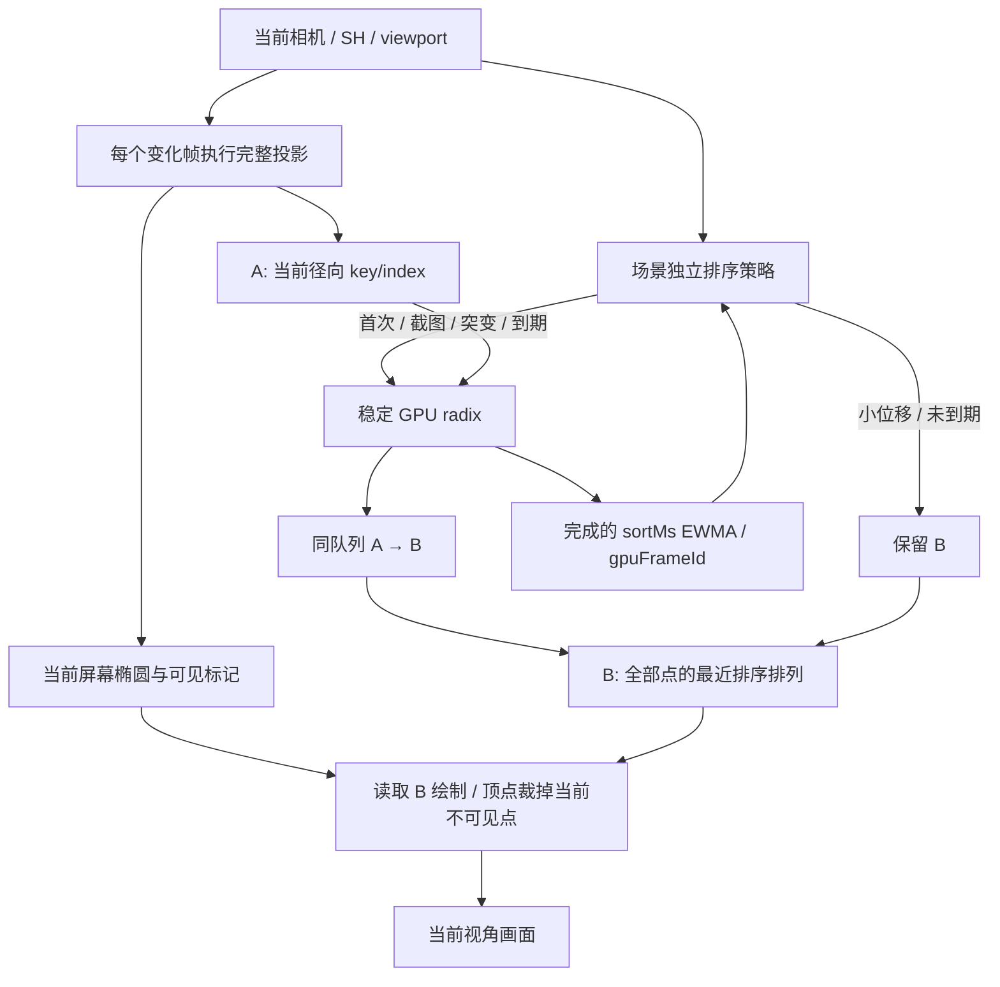

# Web GPU 排序自适应延续验证报告

2026-10-06；目标 SDK `@native3dgs/web@0.2.2-preview.3`。本报告配合
[pthread 解码报告](pthreads-2026-10-06.md) 和
[排序提供者契约](../SPEC-adaptive-sorting.md)。发布目标为原生 v0.2.2 的 preview.3 Web 资产，实际 SDK 源码提交见包内 MANIFEST.json。报告链接的汇总 JSON 保存在仓库，不随 SDK 包分发。

## 从 Spark 学习的机制

固定基准为 `@sparkjsdev/spark@2.3.1`，安装模块
`node_modules/@sparkjsdev/spark/dist/spark.module.js` 的 `driveSort()`
（阅读入口约 12534 行）使用 sorting/sortDirty 合并待处理请求、
minSortIntervalMs 延迟启动、GPU 深度读回、WASM Worker RPC `sortSplats32`
及 orderingTexture 发布。Worker 返回前继续绘制已有 ordering；完成后
再次处理最新请求。来源包及实际 Vite 服务模块的 SHA 在证据中核验。
上游组织参考为 [Spark GitHub](https://github.com/sparkjsdev/spark)，
不能把 upstream main 当作 npm 2.3.1 的同一二进制。

本引擎借鉴的是排序与投影/绘制解耦、复用有效排列和有界更新。
实现为原创 WebGPU GPU radix 调度；没有移植 Spark 的源码，也没有把
单个 WebGPU queue 的串行命令描述成排序与绘制在 GPU 上同时运行。
在排序更新帧仍先完成 radix，再以新排列绘制；复用帧省掉 radix。

## 最终架构与正确性

旧实现的投影会覆写排序 A，且 indirect count 只包括当时可见的点，
因此直接跳过 radix 会破坏排列或漏掉新出现的点。新策略保留完整 B，
每点投影先清除可见标记，再处理所有裁剪出口。绘制完整索引，顶点阶段
先读取 alpha 标记，剔除无效项后才读取可能陈旧的几何数据。
新出现的点能立即投影和绘制，不等待下一次排序。

径向排序使用到相机位置的距离，位置不变时视线转向不改变排序关系。
小位移允许暂时复用透明度顺序，但投影、SH、裁剪和模型点数持续保持当前值。
位置误差小于 1e-7 场景对角线被视为重建浮点噪声。首次、候选验证、截图、
恢复后首次绘制、viewport/quality/Y 翻转和大幅相机跳变强制刷新。
设备恢复重新上传并初始化策略；不同模型不共享排序状态。

默认刷新间隔：`min(100 ms, max(1000/60 ms, 8 × EWMA(sortMs)))`。
暂停、后台、零视口和队列满时不强行提交；该年龄是可提交时的调度界限，
不是 GPU 完成或屏幕扫描 deadline。交互停止后仍补齐待更新的排序；
没有位移的静止或纯转向可长时间复用，排序年龄随之增长但位移误差为零。

复用既有 A/B；没有额外的每点缓冲，不削减点、SH 或 float32 精度。
strict 的可见前缀绘制路径保留，preview.3 默认 adaptive，显式 strict 保留旧行为。截图刷新后，三种布局
都与 strict 逐像素相同。

## 实验记录

环境：Ryzen 7 5700G（8 核 16 线程），RTX 3080 10 GiB，Edge 154，
1920×1080，普通持久 profile，每模型/模式完全新浏览器进程，
SDK 在途帧上限 2，完整点/SH3，WASM 解码 parallel/4。加载、输入和
服务资产 SHA 在计时外核验。原始模型不进入仓库或 SDK 包。

| 尝试 | 最大 SPZ 连续交互 FPS，3 次 | 判断 |
| --- | --- | --- |
| 完整排列复用，interval=4×sortMs，10 秒采样 | 31.4 / 31.4 / 31.3 | 有收益；作为第一轮证据 |
| GPU 可见子序列稳定压缩，10 秒采样 | 27.4 / 27.2 / 27.1 | 比第一版更慢，全部撤回 |
| 完整排列复用，interval=8×sortMs，20 秒采样 | 32.95 / 32.95 / 32.95 | 最终候选；下面提供同条件对照 |

压缩实验复用 radix 第一 bin 的 histogram/prefix/block/params，执行
count→group scan→block scan→stable scatter 后绘制 A 的可见前缀。
整体额外工作未抵消顶点裁剪成本，测量为负收益；不保留没有收益的复杂性。
10 秒与 20 秒样本路径长度不同，不能直接用它们计算精确收益倍数。
证据：[初版](evidence/adaptive-2026-10-06/full-permutation/results.json)、
[撤回实验](evidence/adaptive-2026-10-06/compacted/results.json)。

## 同条件连续交互

最终协议每配置预热 5 秒、20 秒×3；每轮按墙钟运行 orbit/zoom/pan
（18 秒一周期），没有逐帧 finish、fence 或 timestamp 等待。
指标是 SDK/引擎帧提交，不冒称显示器物理呈现 FPS。
1% low 由最慢 1% 提交间隔的均值换算。Native 排序年龄描述本次绘制所用
GPU 排列的提交位置；同队列保证 radix/copy 先于该绘制执行。
Spark 年龄取实际 Worker 已完成排序对应的输入位置。最终 Native 工具在 stats.sorted 时保存产生该排列的相机输入时间，后续绘制从该时间计算年龄；无法归属时为 null，不是 GPU 完成时间。早期 final-adaptive/final-baseline 的 Native 年龄是旧近似，本表 adaptive 已用 corrected-adaptive 重测；strict FPS/1% low 沿用先前同协议基线，年龄旧口径不混用，显示为 —。用户要求停止实测，corrected-strict 只完成一模型，complete=false，不用于最终比较。Spark 算法未变，沿用同协议的先前三轮，不将其描述为与新 Native 交错执行。
位置误差诊断 Native 用场景对角线归一化，Spark 工具使用视点半径；二者不能直接比较归一化比例。
Spark 没有等价 GPU 完成观测，交互 cameraToComplete 仅在 Native 内部解释，不虚构跨引擎完成延迟对照。

| 模型 | 引擎 / 策略 | 提交 FPS 中位 | 1% low 中位 | 排序姿态年龄 p95 中位 ms | 每 20 秒排序更新观测中位 |
| --- | --- | ---: | ---: | ---: | ---: |
| spz/shengyi_v1.spz (804,758 点) | Native strict | 119.95 | 110.11 | —（旧口径） | 2398 |
| spz/shengyi_v1.spz (804,758 点) | Native adaptive | 120.00 | 111.34 | 25.00 | 929 |
| spz/shengyi_v1.spz (804,758 点) | Spark 2.3.1 | 120.00 | 96.10 | 41.95 | 963 |
| zhihuizhimen.ply (3,914,609 点) | Native strict | 119.90 | 107.71 | —（旧口径） | 2397 |
| zhihuizhimen.ply (3,914,609 点) | Native adaptive | 120.00 | 114.25 | 24.99 | 927 |
| zhihuizhimen.ply (3,914,609 点) | Spark 2.3.1 | 120.00 | 51.61 | 183.74 | 207 |
| spz/jiulonghu_v1.spz (22,480,361 点) | Native strict | 28.95 | 23.55 | —（旧口径） | 578 |
| spz/jiulonghu_v1.spz (22,480,361 点) | Native adaptive | 32.55 | 21.99 | 75.19 | 218 |
| spz/jiulonghu_v1.spz (22,480,361 点) | Spark 2.3.1 | 31.26 | 8.85 | 1131.10 | 31 |

最大模型 Native adaptive 相对 strict 提升 12.43%，相对本次 Spark 提升 4.12%；本机本轨迹结果，不推广到全部模型/硬件。Native 更新观测是提交编码次数，Spark 是 Worker 完成次数，不能把这列直接称为同范围的排序吞吐率。中小模型的 FPS 受 120 Hz 上限约束。

证据：[重测 adaptive](evidence/adaptive-2026-10-06/corrected-adaptive/results.json)、
[strict/Spark 先前同协议](evidence/adaptive-2026-10-06/final-baseline/results.json)。
中小模型若都到 120 FPS，不能据此声称在这些模型上有帧率提升。

## GPU 细分阶段

| 策略 / 帧类别 | 样本 | projection ms | radix ms | draw ms | GPU 总 ms | 完成墙钟 ms |
| --- | ---: | ---: | ---: | ---: | ---: | ---: |
| strict / all | 360 | 9.830 | 8.716 | 16.122 | 34.603 | 36.982 |
| adaptive / sort update | 121 | 10.945 | 8.520 | 16.122 | 36.110 | 38.040 |
| adaptive / reuse | 239 | 10.879 | 0.000 | 16.122 | 27.001 | 28.985 |

最大 2248 万点 SPZ，完整 SH3；两模式强制截图 RGBA SHA256 相同：`a360638ccc812b5d9265073958f72540b3d6e8424d63e5546157db68cbb4e265`。复用帧继续完整投影；减少的是 radix 更新频率，绘制完整索引的成本也明确计入。

阶段协议单独使用 30 帧预热 + 120 帧×3，并逐帧等待 GPU fence/timestamp map，
核验 `gpuFrameId === frameId`。其墙钟不能解释为实际浏览 FPS。
projection、sort、draw 为完成的 GPU 时间；gpuMs 包括命令间隙和排序索引 copy。
更新帧与复用帧分别统计，省略排序的帧 sortMs=0。
证据：[stages](evidence/adaptive-2026-10-06/stages.json)。

## 测试、兼容性和审查

默认 adaptive + decoder auto/4 已验收；strict/single 显式回退保留。

- 57 单元、22 契约，严格类型/格式/模块边界；GPU sort 0–1M、SH0–3、跨页/尾点、图像/Y 反射及引擎取消/失败/恢复通过。
- [38 模型×single/auto](evidence/adaptive-2026-10-06/default-models.json) 的 76 次完整加载通过；[与先前基线比较](evidence/adaptive-2026-10-06/default-model-parity.json) count/SH/bounds/RGBA 全部一致。
- [16 能力/故障/取消场景](evidence/adaptive-2026-10-06/default-capabilities.json) 通过，包括非隔离回退、显式 parallel 失败、注入 Worker 资产缺失/挂起及各加载阶段取消。
- [100 生命周期+3 分钟 soak](evidence/adaptive-2026-10-06/default-stability.json)：实际 1280×900，bufferBytes=235403232 恒定，dispose 后所有归属资源为 0。随后仅改读取计量边界，不改变释放/排序/解码数学。
- [独立 tgz 接入](evidence/adaptive-2026-10-06/sdk-consumer.json)：SSR、文档类型检查、React StrictMode/Vue、生产/开发真实 pthreads 与省略 sorting 的 adaptive 默认、卸载 0device/0Canvas 通过。
- [读取口径修正回归](evidence/adaptive-2026-10-06/read-metric-validation.json)：PLY、legacy SPZ、最大 SPZ，两后端完整截图一致。readMs 为发起至完成墙钟，readWaitMs 为等待；预取可重叠，不能相加或声称存储本身加速。
- OCR 整合首轮 31 文件 9 发现，默认整合复查 33 文件 2 发现，均已核验处置；[逐项说明](evidence/adaptive-2026-10-06/ocr-disposition.md)。

全部模型矩阵在读取计量修正前完成；成功路径的解码/渲染数学未变。新口径另外对三类模型做回归，不冒称所有证据对应每一个最终源文件哈希。模板和最终 Release 下载验收记录在独立发布报告中。

实际 fixture 包括 padded/compact/tiled、跨页和尾部点、固定位置转向出现
新可见点、当前投影变化、位移复用、停止后刷新、Y 翻转、全裁剪黑图、
强制截图逐像素一致及相同资源申报。
`EngineOptions.sorting` 为可选增量契约；React/Vue 接受同一选项。
`sortAgeMs`、`sortPositionErrorRatio`、`sortReason` 为可选新增字段，
原有 Snapshot/mock 构造无需补齐。GPU 阶段仍以 gpuFrameId 归属。

接入方式和参数范围见 [preview.3 迁移指南](../SDK-migration-preview3.md)。
显式 strict 保持每个变化帧重排；默认 adaptive 适合愿意接受小位移过程中临时
透明混合顺序差异的浏览场景。没有声称所有 GPU、所有场景都更快。
38 模型的完整解码/count/SH/bounds/固定截图基线见 pthread 报告；本轮
排序交互测试选取 3 个代表模型，不把它表述为 38 个模型的完整交互矩阵。

逐帧采样与浏览器截图作为本地原始档案保留，Git 记录汇总、归属和输入/服务资产核验，不将其作为 SDK 运行资产。

用户在 2026-10-06 明确要求停止实测。corrected-adaptive 三模型已完成，corrected-strict 未完成，保留为不完整档案。最大模型新 adaptive FPS 中位 32.55，先前 strict 为 28.95，Spark 为 31.26；对应增幅约 12.43%/4.12%。本轮 adaptive 的 1% low 为 21.99，低于先前 strict 23.55，不能声称所有稳定性指标均改善。后续模板仅升级、安装和构建，不再进行新的浏览器或单元测试。
