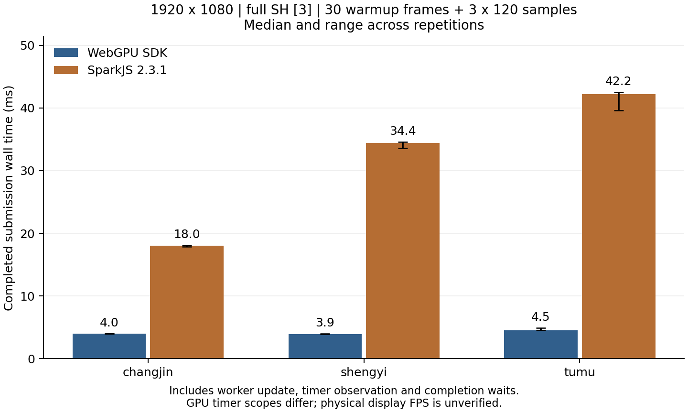

# 完整大型模型与阶段优化验收

2026-10-04；ForWeb 0.2.2-preview.1。功能与最终性能验证均在最终功能源码上完成，随后修订限文档、版本与证据；源输入和产物哈希见build-manifest。最终验收以本文件及release evidence为准；首轮8/38、compact streaming基线、早期无节流和30分钟长稳记录保留历史属性。

## 范围与数据路径

保留全部点、SH0–3 和 float32 属性，不使用抽点、降阶或隐式 LoD。大 PLY 和 gzip SPZ v1–3 采用 Worker/WASM 有界解码、OPFS backing 与逐页 GPU 投影；SPZ v4 保留已有内存路径。模块依赖和 native 数学契约没有改变。

URL → 分块下载至 OPFS → 格式预检 → PLY 行批次 / 校验 gzip 并写入列数据 → 小批次 native 规范化 → float32 属性分块 backing → 一次全局 rebase → 有界 GPU 上传 → 全局投影/稳定排序/绘制 → 首帧完成。

每批最多 65,536 点且源属性总字节不超过 4MiB。SPZ 对应列段并发读取；批次按 64 点对齐，末尾补齐仅是储存布局，逻辑 count 不变。末尾 padding 不参与投影、排序或绘制。GPU 上传按 4MiB 读取，累计 32MiB 后等待 fence。旧场景替换、恢复、取消和关闭共同管理 backing 引用与临时目录。

## GPU 消融

[layout-ablation.json](evidence/layout-ablation.json)：同一完整 SH3 场景、1920×1080、固定相机及 120 个相同姿态，每配置 30 帧预热＋120 帧采样，三轮交错执行。固定相机图像 SHA 在每个模型的三种配置、九次捕获中完全一致。时间戳有约 65.5μs 量化；没有其他 GPU 测试并发。

| 模型 / 点数 | 原动态 AoS 投影 p50 | 专门化 AoS 投影 p50 | 64 点属性分块投影 p50 | 原/最终 GPU 帧 p50 |
| --- | ---: | ---: | ---: | ---: |
| shengyi / 804,758 | 2.490 ms | 1.966 ms | 0.393 ms | 3.998 → 1.442–1.507 ms |
| tumu / 1,248,730 | 4.260–4.456 ms | 3.015 ms | 0.590 ms | 6.160 → 2.228 ms |

着色器专门化分别节约约21%及29–32%投影时间；在专门化基础上改变内存布局再节约约80%。最终投影相对动态AoS降低约84–87%，整个GPU帧降低约62–64%。数据超过三轮观测波动，因此保留。该结论比较本引擎的相同工作，不代表网站实际呈现FPS。

[large-sort-before.json](evidence/large-sort-before.json) 与 [large-sort-after.json](evidence/large-sort-after.json) 记录 lane bitmap/popcount 稳定 rank：804,758 键 1.835 → 0.393ms，1,248,730 键 2.884 → 0.524ms。2D dispatch 与分段 prefix 支持超过 16M 的键数。默认仍为 4-bit；8-bit 没有可靠整帧收益。

## SparkJS 对照与薄弱点

[benchmark-release/results.json](evidence/benchmark-release/results.json)：SparkJS 2.3.1，完整SH3、关闭LoD，双方1920×1080、相同120姿态路径、30帧预热＋120帧×3。六组complete:true、failures为空。一次只完成一个帧。Spark显式update并断言sortedCenter对应当前相机，随后gl.finish，等待本帧timer query可用；native等待WebGPU队列和本帧timestamp map。样本核验当前frameId和有限计时值。Spark保留默认readPause，双方GPU query scope不同。旧benchmark-tiled缺少相同timer归属等待，不作为本表数据。

| 模型 | native 完成帧 p50 | Spark 完成帧 p50 | native 首个完成加载 | Spark 首帧 |
| --- | ---: | ---: | ---: | ---: |
| changjin / 170,799 | 4.0ms | 17.9–18.1ms | 612.3ms | 614.7ms |
| shengyi / 804,758 | 3.9–4.0ms | 33.6–34.6ms | 1801.7ms | 1041.5ms |
| tumu / 1,248,730 | 4.5–4.9ms | 39.6–42.5ms | 2756.4ms | 1250.6ms |

完成帧墙钟结果包含浏览器 IPC、读回与 timer 观察，native 约 4ms 的下限不能解释为纯 GPU 时间；Spark update 包含 Worker 排序和默认 readPause。此协议验证排序新鲜度与已提交工作的完成，不测物理扫描或 motion-to-photon，也不能证明在任意宿主、输入速度和并发方式下优于 Spark。



九个固定视角全图SSIM最低0.996856，foreground SSIM最低0.992675；见[质量指标](evidence/benchmark-release/image-quality.json)。这验证静态对照，不证明运动时每像素透明排序误差等价。

仍存在的薄弱点是中型模型首次加载速度：Spark 在该协议中更快。ForWeb 为容量与可靠性保留磁盘下载、属性储存、全局 rebase 和 backing 上传等 I/O；无法将端到端差异归因于 Rust/C++ 或单独解码。SPZ 批次优化已有最大模型阶段证据，最终值见下方模型记录。进一步减少中间 SoA/pack 拷贝、对小模型选择内存快路径或引入可取消 Worker 复用，需要分别验证数学、取消、峰值和收益；没有把尚未完成的建议算作优化。

Spark 的解码/建树/量化组织方式及可借鉴部分见 [源码研读](spark-decoder-source-study.md)。采用的是有界分块、输入/输出接口分离和局部性原则；没有复制其源码，未改写为第二套 Rust 解码器，未实施 LoD 建树。

## 正确性与复审

- WASM 覆盖 SPZ v1–4/SH0–3、fractionalBits 25/30、gzip CRC/精确长度/尾随成员、字段重排与非法数值。
- tiled 数学覆盖 65/127/129 点、所有 SH 阶、每个非零属性与全局 rebase；GPU 129 点三页且最后一页一有效点，SH0–3 与 AoS RGBA 完全一致。
- 宽 PLY：150,000 点、1236 字节/行、185,407,617 输入字节，在 64MiB CPU 策略下完整加载且 OPFS 清理完成。
- 最大 PLY 暴露临时批次局部原点 float32 舍入的边界误拒绝。新批次 finish 保留 world 中心、原始 min/max 并以零 origin 执行完整共享 validator；未放宽 native 校验容差。失败记录保留于 [model-tests-tiled-bound-failure.json](evidence/model-tests-tiled-bound-failure.json)，回归复现旧拒绝并验证新路径。
- dispose 的 timestamp 与 GPU queue 共享 2 秒超时，永久未完成的 timestamp 假时钟回归验证资源仍销毁。
- 独立只读复审关闭上述必改项，复核布局、ownership、CPU scratch、边界与 Spark 源码描述；未发现未处理必改问题。

## 兼容性边界

“任何电脑完整渲染”不具备可验证的无条件保证。需要安全来源、WebGPU、OPFS 配额、可用 RAM/VRAM 和设备 buffer/binding 上限。最大模型 GPU 场景约 6.58GB，不能保证低显存设备完整驻留；策略预算 8GiB 不是显卡剩余容量。不存在能力或预算不足时返回明确错误；未进行静默降点或降 SH。

本机的完整加载和 GPU 完成帧测试不代替跨厂商、macOS/Safari/Firefox、移动浏览器、睡眠恢复或真实硬件 reset。低资源设备的显式 LoD、远端渲染与云客户端需要独立实现与质量契约。浏览器正常关闭会清理存储，异常进程退出后的残留需由宿主设计多标签页安全回收，不能随意删除其他活跃实例目录。

## 发布源码完整模型与稳定性

[model-tests-release.json](evidence/model-tests-release.json)记录38/38成功，每个模型核验manifest点数和SH，不把明确拒绝算成功；errors为空。12次连续加载/取消压力、close/recovery和最后Stopped完成，正常OPFS清理通过。全套按顺序运行，阶段时间是状态边界墙钟，不是纯WASM kernel或独立GPU时间。

| 最大模型：22,480,361点/SH3 | PLY | SPZ |
| --- | ---: | ---: |
| 加载完成，不含清理 | 39,381.4ms | 30,382.4ms |
| 清理 | 513.9ms | 504.1ms |
| Inspecting | 34.0ms | 35.6ms |
| Downloading | 11,262.3ms | 1,329.5ms |
| Inflating | — | 4,928.1ms |
| Decoding | 14,877.2ms | 11,479.5ms |
| Rebasing | 3,609.5ms | 3,471.8ms |
| Uploading/首帧呈现 | 9,598.3ms | 9,137.8ms |

两个格式各保留GPU场景6,575,533,896字节与backing5,305,370,624字节。cpuResidentBytes为0指引擎没有保留整份ArrayBuffer，不代表进程RSS或页缓存为0。旧maximum-final-repeat和各基线数据用于历史变化诊断，不混入本表。

[maximum-completed-frame.json](evidence/maximum-completed-frame.json)为同一最大SPZ、1920×1080、30帧预热＋120姿态×3的最终重测：GPU p50为38.404/38.339/35.914ms；投影11.993/11.534/10.945ms，排序9.241/9.175/8.782ms，绘制17.039/17.105/15.991ms；完成帧墙钟41.1/40.3/38.0ms。独立加载首帧29,656.2ms，errors为空。各阶段p50之和不一定等于总帧p50。大模型绘制约占GPU帧四成，重叠透明光栅与全点排序仍是继续优化方向，不能以小模型收益推算最大模型FPS。

[stability-release.json](evidence/stability-release.json)为最终源码100次生命周期＋5分钟持续相机运动，complete:true：34次替换、33次取消、33次创建/卸载；十次稳定性采样均Ready，GPU/frame持续前进，errors为空。场景buffer数/字节固定为21/49,963,720；最后dispose的device/context/buffer/bytes/Worker均为0、phase为Stopped。强制GC后JS heap约2.796–2.816MB，只是浏览器堆观测；36,000次运动回调不等于独立呈现帧数。早期30分钟测试不是本版30分钟测试。

36个CPU测试、18个契约测试（含WASM与基准守护）、GPU排序/图像、联合、streaming及实际tgz消费均通过。SSR导入、React生产/开发StrictMode和Vue条件容器重绑均验证，卸载后0device/0Canvas。最后一轮OCR无critical/high，3个medium已修复并回归；六轮82条观察的处置见[OCR报告](ocr-review-report.md)。

## 复现与交付

Node24.14.1、pnpm11.4.0、Emscripten6.0.11、Windows/Edge154、RTX3080 10GiB、驱动616.92。构建、模型和资源证据见同目录evidence；模型不发布。核心复现命令从ForWeb执行，真实GPU测试顺序运行：

```powershell
pnpm run build:wasm
pnpm run build
pnpm run test:unit
pnpm run test:contracts
pnpm run test:gpu
pnpm run test:integration
pnpm run test:sdk
$env:GS_MODEL_ROOT='C:\Users\21544\Desktop\zhishan'
$env:GS_MODEL_OUTPUT='docs/verification/evidence/model-tests-release.json'
pnpm run test:models
$env:GS_BENCH_OUTPUT='docs/verification/evidence/benchmark-release'
node tools/completed-benchmark.mjs
node tools/layout-benchmark.mjs
node tools/maximum-frame-benchmark.mjs
python tools/image-metrics.py docs/verification/evidence/benchmark-release
python tools/plot-completed-benchmark.py docs/verification/evidence/benchmark-release
```

模型/浏览器命令需要另一个终端运行开发服务器。具体输出环境变量以tools脚本为准；默认test:stability运行30分钟，本次发布证据明确使用5分钟。Web包名称为Native3DGS-SDK-0.2.2-Web-WebGPU-preview.zip，内含native3dgs-web-0.2.2-preview.1.tgz、完整assets/licenses和专业Vue/React指南。MANIFEST记录实际Web commit/tree；附加到原生v0.2.2不表示Web代码已在该tag，也不自动合并PR。
