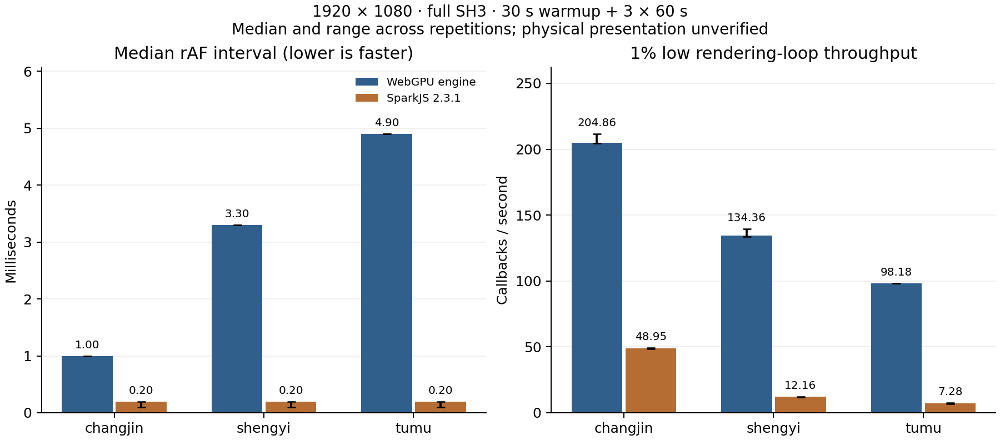

# Web 3DGS性能优化与SparkJS对照

2026-10-04。本轮完成阶段优化、正式有节流与无节流SparkJS对照，以及审查后的长稳验收。排序与PLY解码明显改善；正式无节流结果仍没有达到中位间隔降低20%的目标。本引擎平均循环吞吐量低于Spark，尾部间隔更稳定。测量的是浏览器渲染循环，尚未验证物理呈现及双方动态排序质量完全等价，不能宣称整体胜出。

## 1. 测量协议

Windows、RTX3080 10GiB、驱动616.92、Edge154.0.4258.53，headless真实NVIDIA WebGPU；1920×1080物理像素、DPR1。SparkJS2.3.1、Three0.180.0，对照不是根计划早期Spark2.1。模型SHA与点数见[manifest](evidence/model-manifest.json)。

三个规模：changjin PLY170799点、shengyi SPZ804758点、tumu SPZ1248730点，全部完整SH3。每引擎每模型30秒预热、60秒采样三轮。相机随时间沿相同12秒周期、±0.20rad轨迹运动；相同FOV60度、径向排序、Gaussian3σ、minAlpha1/255、preBlur0.3、maxRadius4096、无LoD、黑色背景、预乘alpha及色域。Spark启用extSplats/accumExtSplats避免默认半精度与本引擎完整float32混为等画质。

PLY规范化RDF→RUB；Spark PLY绕X轴π，SPZ已经RUB无需重复旋转。初期错误旋转的calibration结果保留用于诊断，没有进入正式结论。三模型各默认、左近景、右近景，共九视角。

正式双引擎原始数据为[benchmark-full](evidence/benchmark-full/results.json)：默认4-bit分层排序。8-bit复测为[benchmark-retuned](evidence/benchmark-retuned/results.json)，仅原生三模型，各同样30秒+60秒×3；使用已固定的原Spark结果作诊断参考，不称其为同时执行的全新双引擎基准。

最新正式对照为[benchmark-uncapped](evidence/benchmark-uncapped/results.json)：在100次生命周期与30分钟长稳通过、对应浏览器关闭后顺序执行，六组均完成三轮且errors/disposalErrors为空。两端同时使用`--disable-frame-rate-limit --disable-gpu-vsync`，没有其他GPU测试并行。实测持续绘制间隔已明显低于8.3ms，确认解除原调度上限；这不证明物理显示器扫描同样频率。当前测量在draw提交后进入下一次rAF，不逐帧等待GPU fence，不是GPU完成帧或motion-to-photon测量。

## 2. 画质前提

九视角整图SSIM最小0.996856；前景ROI SSIM范围0.992675–0.999041，超过0.95门槛。ROI为双方非黑像素联合包围框，外扩8像素；另记录前景MAE，避免大片黑背景抬高SSIM。逐项数据见[image-quality.json](evidence/benchmark-full/image-quality.json)，同目录保存双引擎PNG、4倍差异图和三栏图。SH/透明/协方差等合成夹具另逐像素检验，不用SSIM掩盖局部数学错误。

4-bit和8-bit九视角RGBA逐字节一致（maxAbsError0、changedBytes0），SHA证据见[radix-render-equivalence.json](evidence/radix-render-equivalence.json)。原始RGBA留本地且不提交，PNG/JSON/CSV可以审阅。

正式无节流的九视角重新计算得到相同SSIM/ROI结果，见[新的image-quality.json](evidence/benchmark-uncapped/image-quality.json)。静态图像满足门槛，动态排序滞后仍需单独解释，静态SSIM不能替代动态图像检验。

## 3. 已接受的优化

| 测量范围 | 初版 | 改进后4-bit | 解释 |
| --- | ---: | ---: | --- |
| 170799键GPU排序 | 5.83ms | 0.524ms | 分层扫描与工作组内稳定rank |
| 804758键GPU排序 | 70.91ms | 1.835ms | 移除单工作组串行全局prefix瓶颈 |
| 1048576键GPU排序 | 87.82ms | 2.294ms | 对CPU参考保持稳定同键顺序 |
| changjin预加载WASM probe+normalize中位 | 1104.14ms | 33.6207ms | 在gs_begin预编译PLY字段offset，移除逐点字符串比较/SH索引解析 |

排序原始样本见sort-baseline.json、sort-hierarchical-scan.json和sort-local-rank.json；PLY五轮原始数据见[decode-baseline](evidence/decode-baseline.json)和[decode-compiled-fields](evidence/decode-compiled-fields.json)。PLY约32.8倍仅覆盖预加载probe+normalize，排除下载、Worker启动、GPU页pack/上传/首帧。完整加载在不同运行中约0.36–0.49秒，不能宣称整个引擎32.8倍。

每场景排序bindgroups缓存，避免每帧重复创建40组绑定。释放场景时清理计时器持有的CPU页引用，降低关闭后保留；预算包括排序scratch/块offset/参数/minimum allocation和并发readback。安全复审新增gzip固定scratch精确长度/CRC验证，旧gzip SPZ会增加一次验证解压，属于有意保留的输入安全成本。

## 4. 8-bit实验与回退决定

独立排序每配置5轮预热+30轮GPU计时，稳定CPU参考通过：

| 键数 | 4-bit中位ms | 8-bit中位ms | 独立排序变化 |
| ---: | ---: | ---: | ---: |
| 170799 | 0.524288 | 0.458752 | -12.5% |
| 804758 | 1.835008 | 1.638400 | -10.7% |
| 1248730 | 2.752512 | 2.228224 | -19.0% |
| 1888950 | 3.604480 | 3.473408 | -3.6% |

原始样本见[radix-experiment.json](evidence/radix-experiment.json)。完整轨迹GPU帧复测却为：

| 模型 | 默认4-bit中位ms | 8-bit复测中位ms | 整帧变化 |
| --- | ---: | ---: | ---: |
| changjin | 2.031616 | 2.162688 | +6.45% |
| shengyi | 3.211264 | 3.342336 | +4.08% |
| tumu | 4.849664 | 4.849664 | 0% |

GPU时间戳在本浏览器有明显约65.5μs量化，实验顺序、频率及输入分布也会影响结果。这不是严密统计显著性证明，但不足以接受默认切换；因此最终保留4-bit默认，8-bit仅内部对照。随机/重复键排序微基准不能代替真实相机生成的键分布或完整帧。

## 5. Spark对照结果与解释

### 5.1 原有节流对照

三轮中位统计，保留用于说明调度上限：

| 模型 | 两端rAF p50/p95/p99 ms | 本引擎1%low FPS | Spark1%low FPS | 本引擎GPU中位ms | Spark同步GPU中位ms |
| --- | --- | ---: | ---: | ---: | ---: |
| changjin | 8.3/8.4/8.5 | 117.46 | 117.19 | 2.032 | 1.638 |
| shengyi | 8.3/8.4/8.5 | 117.44 | 117.09 | 3.211 | 2.494 |
| tumu | 8.3/8.4/8.5 | 117.47 | 117.15 | 4.850 | 2.600 |

每轮样本、p95/p99和最慢1%平均间隔的倒数见[summary.json](evidence/benchmark-full/summary.json)。两端平均约120FPS且p50重合于刷新节奏，属于调度节流；不能把几十分之一FPS的1%low差异当胜出。此条件下20%目标不可判定；不再将其作为唯一正式对照。

本引擎timestamp覆盖projection+完整GPU radix+draw。SparkWebGL query只覆盖同步render，异步Worker排序和之后的GPU提交不在此scope，两列不是等价总成本。它能提示本引擎完整排序成本随点数上升，但不能据此宣称Spark整体快1.86倍。后续应补Spark排序结果的新鲜度/相机延迟、全部提交与Worker耗时关联，及不受刷新限制的相同质量压力场景。

### 5.2 正式无节流对照

下表各项均为三轮统计的中位值。平均吞吐量为1000/所有间隔均值，1%low为1000/最慢ceil(N×1%)间隔均值，单位都是回调/秒。CSV每帧记录及GPU frameId去重结果见[summary.json](evidence/benchmark-uncapped/summary.json)与[comparison.json](evidence/benchmark-uncapped/comparison.json)。

| 模型/引擎 | rAF p50/p95/p99 ms | 平均循环吞吐量 | 1%low | GPU中位ms/范围 |
| --- | --- | ---: | ---: | --- |
| changjin / 本引擎 | 1.0/1.6/2.0 | 1017.10 | 204.86 | 0.983 / 投影+排序+绘制 |
| changjin / Spark | 0.2/0.3/0.4 | 2820.30 | 48.95 | 0.322 / 同步WebGL |
| shengyi / 本引擎 | 3.3/6.3/6.7 | 303.82 | 134.36 | 3.277 / 投影+排序+绘制 |
| shengyi / Spark | 0.2/0.3/0.4 | 1027.53 | 12.16 | 0.953 / 同步WebGL |
| tumu / 本引擎 | 4.9/9.6/10.0 | 202.52 | 98.18 | 4.850 / 投影+排序+绘制 |
| tumu / Spark | 0.2/0.3/0.4 | 653.98 | 7.28 | 1.516 / 同步WebGL |



本引擎三轮p50分别固定1.0、3.3、4.9ms；Spark各组p50在0.1–0.2ms之间，受到JS约0.1ms计时粒度影响。Spark短回调可以成批提交，p50小于同步GPU查询值；不能将其解释为0.2ms完成一个全排序GPU帧。平均值和最慢1%揭示极少数长间隔，p99接近0.4ms并不保证没有这些间隔。采样对象分配、GC、CPU提交与浏览器/驱动队列行为均包含在循环测量中，需要trace才能归因；不把本无节流headless下的尾部结果推广为网站实际卡顿率。

本引擎平均循环吞吐量只有Spark约29.6%–36.1%，但循环1%low更高。每个模型的p50均没有满足本引擎≤Spark×0.80，因此当前循环指标上的20%条件未达成。物理呈现与等排序新鲜度的完整验收仍未完成；不能仅用较好的尾部、阶段优化倍数或静态图像宣布通过。

原始间隔审计：本引擎六十秒各轮最大间隔17.0–18.0ms；Spark小模型497.7–712.1ms，中模型3140.6–3798.5ms，大模型4312.1–5815.5ms。Spark中/大模型每轮分别出现28–30和22–23次大于1秒的间隔，本引擎没有。对应计数、最大值及最慢1%占总间隔时间比例均已加入summary.json。这解释了p99仍小而1%low很低的现象，但具体队列/驱动/GC归因仍需trace，不是已经证明的Spark生产问题。

原有节流与无节流协议下的小模型GPU时间不同，不能把这个跨协议变化归功于新的源码优化。GPU频率/队列状态和时间戳量化会影响数据；只有同一协议中的受控实现变更才用于接受优化。

### 5.3 排序输入滞后诊断

正式基准结束后单独运行[spark-sort-freshness.json](evidence/spark-sort-freshness.json)，每模型3秒预热+12秒运动。对固定Spark2.3.1实例的readbackDepth/driveSort做只读观察：记录实际选择排序输入时的viewOrigin/viewDirection，并在Promise完成后与随后绘制相机比较。保留默认readPause=1ms、minSortIntervalMs=0，没有改其排序策略；退出前等在途排序结束。complete:true，三组无页面错误或诊断失败。

| 模型 | 12秒完成排序次数 | 输入年龄p50/p95 ms | 完成排序延迟p50 ms | 相机方向差p50/p95 度 |
| --- | ---: | --- | ---: | --- |
| changjin | 63 | 232.2/852.1 | 124.4 | 0.69/4.08 |
| shengyi | 9 | 1606.0/2764.1 | 1485.0 | 4.64/14.48 |
| tumu | 4 | 4041.2/5027.3 | 2905.9 | 9.22/14.49 |

输入年龄是自排序输入选择至当前CPU回调的时间；它不包含该accumulator生成前的年龄。完成延迟覆盖driveSort开始到排序上传已安排，包括默认暂停、深度读回、Worker与提交；不是单独的WASM排序耗时，也不是GPU fence完成。方向差和世界坐标差来自真实输入姿态，不是推算出的图像误差。该短探测与正式三轮分开，有插桩开销，不能当作正式尾部或网站motion-to-photon数据。

无节流压力下完成排序数量远少于提交回调数量，动态排序新鲜度明显不同。这个证据支持把回调吞吐量与每相机版本全量GPU排序分开解释；它没有证明可见误差必然达到某个值。本引擎同一GPU命令序列执行对应相机的投影、排序和绘制，物理显示延迟仍未测量。后续应在有背压的GPU完成帧协议及动态图像误差约束下重新比较，保留正常约120Hz场景作为实际调度参照。

## 6. 已定位的薄弱点与下一步

| 薄弱点 | 本轮处理 | 剩余改进方向 |
| --- | --- | --- |
| GPU全局prefix串行 | 分层扫描，百万排序约87.82→2.29ms | 消融不同真实键分布、并行digit基数offset及平台subgroup配置 |
| PLY每点字段解析 | 一次预编译布局，五轮中位1104→33.6ms | 分块pack并减少normalized/packed副本 |
| 大SPZ临时峰值和wasm32上限 | 预检拒绝、gzip输出精确验证、明确错误 | 分属性/分块直接规范化、流式GPU驻留；不静默降质 |
| 每次相机修订均全量排序 | 本轮保持精确全点/全SH质量基线 | 对可见索引压缩排序，测清剔除成本；误差受控调度需独立契约 |
| 双端排序新鲜度不等价 | 增加独立12秒输入姿态/完成延迟诊断，避免以快速提交声称胜出 | GPU完成背压协议、动态透明图像误差、正常刷新与压力条件分组 |
| 整帧与阶段收益不一致 | 8-bit回退默认4-bit | 真实轨迹阶段分解、fill-rate/近景重叠压力 |
| 生产经验矩阵不足 | 单卡真实浏览器与生命周期测试 | AMD/Intel/Safari/移动、电源模式、真实设备loss |

本报告完成当前本机配置的优化闭环；它没有关闭跨平台或“比Spark快20%”发布门槛。

## 7. 复现命令

```powershell
pnpm run bench
python tools/performance-summary.py docs/verification/evidence/benchmark-full
python tools/image-metrics.py docs/verification/evidence/benchmark-full
# 内部排序实验：
node tools/radix-experiment.mjs
# 请求解除Chromium渲染循环节流；以实测interval确认，不只相信参数：
$env:GS_BENCH_UNCAPPED = '1'
$env:GS_BENCH_LABEL = 'uncapped'
pnpm run bench
python tools/performance-summary.py docs/verification/evidence/benchmark-uncapped
python tools/image-metrics.py docs/verification/evidence/benchmark-uncapped
python tools/benchmark-comparison.py docs/verification/evidence/benchmark-uncapped
python tools/plot-benchmark.py docs/verification/evidence/benchmark-uncapped
node tools/spark-freshness.mjs # 单独短诊断，不能替代正式三轮
```

基准时关闭其他GPU负载，记录版本、GPU/驱动、物理分辨率、质量条件、模型哈希和计时scope。不要把稳定性/功能测试耗时并入正式性能结果。

短cadence-probe仅用于定位参数，1秒且与稳定性浏览器并存，不属于正式性能数据。最终结论使用其后独立完成的六组正式无节流数据。图形脚本另需要matplotlib；质量脚本需要NumPy/Pillow/scikit-image，均为离线报告工具，不是SDK运行依赖。
