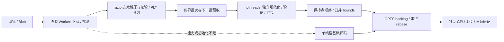

# Web SDK 可回退并行解码验收与性能报告

2026-10-06；目标版本 `0.2.2-preview.3`。本报告记录本机实测，完整点数、SH0–3、float32、GPU 数据布局和相机行为保持。依赖固定到 Emscripten 6.0.11、Node 24.14.1、SparkJS 2.3.1；Ryzen 7 5700G（8 核/16 线程）、RTX 3080 10 GiB、Edge 154.0.4258.53、1920×1080。

## 1. 实现与兼容性

SDK 使用 C++20/Emscripten pthreads 执行分块规范化、校验、bounds 归并及 64 点 tile 打包。每任务独立 decoder/writer/error，直接写入不重叠输出；SPZ 属性范围直接交给固定 vendor 解码数学，减少中间拷贝。协调 Worker 独占 OPFS 句柄，并最多预取下一批输入；额外输入、线程栈和 scratch 纳入 CPU admission。

`EngineOptions.decoder` 为可选增量；默认 auto，线程上限默认 4、范围 1–8（包含协调线程）。新诊断 `Snapshot.decoder` 可选且只读，随活动场景提交/恢复/关闭；失败候选不覆盖旧场景。React/Vue 旧方法和加载调用不变，SSR import 保持可用。详见 [迁移指南](../SDK-migration-preview3.md)及 [规格](../SPEC-parallel-decoder.md)。

非隔离页面 auto 不请求增强资产；小型 PLY 内存路径、SPZ v4、低预算或仅一个硬件线程使用基础版。增强模块 import + factory 共享 10 秒初始化边界；auto 清理失败增强实例并回退，显式 parallel 保留错误。gzip 连续流仍串行校验。GPU 算法没有因解码线程变化而改动；不能把本轮加载收益称作交互 FPS 的线程收益。

## 2. 计算阶段消融

真实 shengyi PLY 预载 4,183,808 字节、17,728 点、SH3，2 次预热、12 次记录；每次校验完整 packed bytes SHA 与 bounds。墙钟批次含输入复制及 dispatch，初始化和 rebase 单独测。

| 配置 | 批次墙钟 p50 / min–max（ms） | input copy p50（ms） | 初始化（ms，单次） | rebase p50（ms） |
| --- | ---: | ---: | ---: | ---: |
| baseline | 4.24 / 4.12–4.41 | 0.27 | 3.45 | 0.07 |
| 1 | 4.39 / 4.23–5.06 | 0.29 | 3.28 | 0.09 |
| 2 | 2.72 / 2.51–2.91 | 0.37 | 33.92 | 0.20 |
| 4 | 1.90 / 1.79–2.21 | 0.35 | 34.57 | 0.22 |
| 8 | 1.36 / 1.21–1.83 | 0.33 | 45.36 | 0.21 |

最终内核 wall p50 为旧基础版 4.237 ms、4 线程 1.904 ms（约 2.23 倍吞吐）、8 线程 1.361 ms。8 线程初始化约 45.36 ms，4 线程约 34.57 ms；实际大场景又有串行 gzip/I/O/上传，不能把内核倍数当作端到端倍数。配置 1 是用于消融的单线程 helper，正式 single 分块路径仍保留逐步解码协议。

inputCopyMs 对所有配置使用同一 malloc + HEAPU8.set 边界，计时外比较完整 packed bytes、bounds 及固定非零偏移 [1.25, -2.5, 0.375] 重定位后的 SHA。baseline decodeMs 是 JS 墙钟（begin_batch/chunk，扣除 copy），新 helper 是 native 每任务最大值；不能作为对等纯 decode 阶段相除，task-max 也不能相加推导墙钟。rebase 并行 p50 约 0.216 ms，旧 scalar 约 0.074 ms，正式路径继续 scalar。完整记录：[kernels-verified](evidence/pthreads-2026-10-06/kernels-verified.json)。

实现迭代的墙钟记录如下，仅作为顺序实验历史（每轮同样 2 预热/12 记录，基线同时重测）；不将不同轮次差值伪称单因素严格 A/B，也不从 PLY 内核结果推断 SPZ 范围拷贝的单独收益。

| 历史迭代 | 旧基线 / 新 helper single / 4 线程 / 8 线程 p50 ms |
| --- | ---: |
| 初次线程化 | 4.161 / 5.436 / 2.688 / 2.250 |
| 直接打包输出 | 4.205 / 4.673 / 2.639 / 2.018 |
| 范围复制与访问缓存 | 4.348 / 4.418 / 2.003 / 1.572 |
| 后续重复 | 4.520 / 4.402 / 1.916 / 1.716 |

上述早期工具有 baseline 初始化计时缺陷；初始化结论仅采用修正后的 verified 证据。线程、直接输出、SPZ 范围复制和预取的端到端结果是组合收益；本轮没有将预取的独立贡献拆成一个虚构数字。

旧 WASM 基线 SHA-256 为 `9369c6f8f62e53d980166ac1d0854e07b11df061e32166499ab55772a0df5295`。复现先取得 preview.2 SDK，将 dist/assets/decoder.mjs 和 .wasm 放入 `.local/parallel-baseline/`，或设置 `GS_BASELINE_DECODER` 指向旧 decoder.mjs（旁边需同版 wasm）。不能将当前单线程 helper 误作旧版基线。

## 3. 38 模型完整性与容量

38 个模型 × 单线程/4 线程共 76 次成功；完整 count、degree 与 manifest 一致，两配置 bounds 及固定 canonical 视角 RGBA SHA 完全一致，关闭后清理 OPFS。最大模型 22,480,361 点、完整 SH3。此矩阵每配置每模型 1 次，用于容量及等价验收；重复性能结论使用后续三轮配对和线程消融。

| 模型 | 文件 MiB / 点数 | single（ms） | 4 线程（ms） | 减时 |
| --- | ---: | ---: | ---: | ---: |
| changjin_v1.ply | 38.44 / 170,799 | 536.79 | 412.47 | 23.2% |
| citang_v1.ply | 476.31 / 2,116,317 | 3490.62 | 3418.89 | 2.1% |
| danganguan_v1.ply | 425.14 / 1,888,950 | 3528.54 | 3176.28 | 10.0% |
| haiwai_v1.ply | 413.70 / 1,838,109 | 3442.50 | 3086.99 | 10.3% |
| he_v1.ply | 669.13 / 2,973,002 | 5412.39 | 4715.29 | 12.9% |
| J1_v3.ply | 590.80 / 2,625,008 | 4884.75 | 4132.92 | 15.4% |
| jiaoxuelou_v2.ply | 502.67 / 2,233,426 | 4048.38 | 3624.65 | 10.5% |
| jiulonghu_v1.ply | 5059.59 / 22,480,361 | 37955.16 | 34569.36 | 8.9% |
| jizhonglou_v2.ply | 354.73 / 1,576,115 | 2937.61 | 2766.82 | 5.8% |
| juyuan_v2.ply | 600.93 / 2,670,017 | 5060.40 | 4380.02 | 13.4% |
| meiyuan_v2.ply | 295.49 / 1,312,897 | 2527.86 | 2304.22 | 8.8% |
| PML_v1.ply | 191.72 / 851,828 | 1582.49 | 1525.07 | 3.6% |
| shengyi_v1.ply | 181.13 / 804,758 | 1579.29 | 1443.87 | 8.6% |
| spz/citang_v1.spz | 40.48 / 2,116,317 | 3193.12 | 2817.04 | 11.8% |
| spz/danganguan_v1.spz | 33.61 / 1,888,950 | 2713.76 | 2406.55 | 11.3% |
| spz/haiwai_v1.spz | 34.81 / 1,838,109 | 2803.75 | 2488.41 | 11.2% |
| spz/he_v1.spz | 48.70 / 2,973,002 | 4242.94 | 3677.68 | 13.3% |
| spz/J1_v3.spz | 47.30 / 2,625,008 | 3829.63 | 3354.35 | 12.4% |
| spz/jiaoxuelou_v2.spz | 43.38 / 2,233,426 | 3157.14 | 2914.02 | 7.7% |
| spz/jiulonghu_v1.spz | 477.56 / 22,480,361 | 29662.42 | 25638.38 | 13.6% |
| spz/jizhonglou_v2.spz | 32.66 / 1,576,115 | 2370.77 | 2021.47 | 14.7% |
| spz/juyuan_v2.spz | 50.17 / 2,670,017 | 3851.04 | 3461.81 | 10.1% |
| spz/meiyuan_v2.spz | 25.41 / 1,312,897 | 1928.23 | 1820.02 | 5.6% |
| spz/shengyi_v1.spz | 17.10 / 804,758 | 1257.39 | 1151.59 | 8.4% |
| spz/tiyuguan_v1.spz | 26.54 / 1,419,007 | 2130.49 | 1913.98 | 10.2% |
| spz/tumu_v1.spz | 23.28 / 1,248,730 | 1851.43 | 1597.84 | 13.7% |
| spz/tushuguan_v1.spz | 28.11 / 1,438,782 | 2193.44 | 1940.99 | 11.5% |
| spz/wenke_v2.spz | 35.71 / 1,757,157 | 2563.33 | 2346.25 | 8.5% |
| spz/xingxi_v1.spz | 25.20 / 1,307,854 | 1897.56 | 1739.14 | 8.3% |
| spz/yulin_v1.spz | 19.96 / 1,027,833 | 1607.35 | 1432.05 | 10.9% |
| tiyuguan_v1.ply | 319.37 / 1,419,007 | 2711.44 | 2387.41 | 12.0% |
| tumu_v1.ply | 281.05 / 1,248,730 | 2352.28 | 2150.14 | 8.6% |
| tushuguan_v1.ply | 323.82 / 1,438,782 | 2841.27 | 2422.43 | 14.7% |
| wenke_v2.ply | 395.48 / 1,757,157 | 3363.85 | 2816.61 | 16.3% |
| xingxi_v1.ply | 294.36 / 1,307,854 | 2503.14 | 2267.07 | 9.4% |
| yulin_v1.ply | 231.33 / 1,027,833 | 2191.71 | 1884.32 | 14.0% |
| zhihuizhimen.ply | 881.05 / 3,914,609 | 7191.54 | 6285.22 | 12.6% |
| zhishan_v3.ply | 146.19 / 649,520 | 1276.46 | 1099.23 | 13.9% |

单次矩阵减时中位数 11.08%，范围 2.06–23.16%；不把单次矩阵当作置信区间。证据：[model-matrix](evidence/pthreads-2026-10-06/model-matrix.json)。有限 RAM/VRAM、OPFS 配额或不支持 WebGPU 的电脑仍有明确能力/预算错误；本机全模型通过不构成任意电脑全模型可加载的保证。

### 最大 SPZ 的细分

下表同样来自一次容量矩阵。阶段为进度状态的墙钟，含 I/O 和调度；内部 read/write/batch task 指标与阶段可能重叠，不能累加。

| 指标（ms） | single | 4 线程 |
| --- | ---: | ---: |
| Downloading | 1156.32 | 1225.79 |
| Inflating | 4998.45 | 4889.32 |
| Decoding | 11056.97 | 6947.13 |
| Rebasing | 3597.36 | 3657.08 |
| Uploading | 8823.35 | 8883.54 |
| initializationMs | 12.88 | 41.45 |
| readMs（历史 await-only 口径） | 2929.48 | 1987.31 |
| writeMs | 1472.68 | 1445.13 |
| batchWallMs | 6689.34 | 3555.24 |
| decodeTaskMaxMs | 0.00 | 2256.68 |
| finishPackTaskMaxMs | 0.00 | 980.14 |
| rebaseComputeMs | 43.30 | 46.42 |

历史 readMs 只计等待预取结果的阻塞时间，不能据该行推断存储本身加速；最终工具改为 readMs 记录每批发起到完成的墙钟，readWaitMs 单列等待耗时。二者及并行 compute/write 可重叠，不能相加。新口径回归见自适应排序报告。

解码已明显缩短，剩余大头包含 gzip、OPFS 读写和分页上传；rebase 的实际计算仅几十毫秒，存储墙钟占主要份额。进一步优化应测压缩/存储/上传边界，不能把 gzip 或磁盘耗时归因于线程数量。

## 4. SparkJS 配对加载与完成帧

8 个代表模型，每配置 3 次交错加载；第二轮反转引擎顺序。完整点/SH3、LoD 关闭、同一世界 pose。firstFrameMs 统计 URL 开始至可用首帧，不包括引擎创建；Spark initializedMs 是网络+解码+packing 聚合，未暴露对等纯 WASM 阶段，因此不虚构单独 Spark 解码耗时。Spark 额外稳定帧等待不计入 firstFrameMs。

| 模型 | single 首帧中位[min–max] ms | pthreads 首帧中位[min–max] ms | Spark 首帧中位[min–max] ms | 并行相对 single 减时 |
| --- | ---: | ---: | ---: | ---: |
| changjin_v1.ply | 413.15 [409.93–565.01] | 410.88 [394.05–428.67] | 340.46 [324.30–642.81] | 0.5% |
| shengyi_v1.ply | 1326.96 [1318.76–1335.41] | 1218.07 [1193.81–1235.93] | 1181.68 [1168.90–1183.92] | 8.2% |
| spz/shengyi_v1.spz | 1176.48 [1109.63–1178.85] | 993.48 [987.86–1003.52] | 896.13 [892.27–897.80] | 15.6% |
| tumu_v1.ply | 2118.00 [2047.13–2124.34] | 1794.31 [1789.53–1796.29] | 1798.94 [1763.71–1804.31] | 15.3% |
| spz/tumu_v1.spz | 1658.91 [1618.88–1715.65] | 1464.76 [1430.29–1504.79] | 1258.38 [1224.61–1353.81] | 11.7% |
| zhihuizhimen.ply | 6534.74 [6519.36–6606.98] | 5844.38 [5678.44–6112.37] | 5711.74 [5629.90–5749.26] | 10.6% |
| jiulonghu_v1.ply | 33045.25 [32664.19–34777.56] | 31576.89 [31478.71–33955.51] | 31839.11 [31082.08–32175.28] | 4.4% |
| spz/jiulonghu_v1.spz | 26099.80 [25936.67–29105.86] | 22273.21 [22103.79–24157.40] | 19536.79 [19258.42–20477.23] | 14.7% |

完成帧阶段：每个配置首次加载后 30 帧预热 + 120 帧 × 3，逐帧核验 frameId 与 GPU timestamp 归属。下列是三个运行 p50 的中位数；原始 p95 分布见 JSON。每帧等待完成/时间戳的 headless 吞吐协议，不是无等待浏览协议，也不是物理显示 FPS。Spark update 含 Worker 排序、协调与 readPause；其 GPU 计时主要覆盖 draw，Native GPU 覆盖投影/排序/绘制，GPU 总数不能直接当作同范围优劣。

| 模型 | single 完成帧（ms） | pthreads 完成帧（ms） | Spark 完成帧（ms） | Native pthreads 投影 / 排序 / 绘制（ms） | Spark update / draw GPU（ms） |
| --- | ---: | ---: | ---: | ---: | ---: |
| changjin_v1.ply | 3.985 | 3.960 | 17.510 | 0.066 / 0.131 / 0.262 | 12.330 / 0.972 |
| shengyi_v1.ply | 3.905 | 3.550 | 34.110 | 0.328 / 0.393 / 0.721 | 24.320 / 2.590 |
| spz/shengyi_v1.spz | 3.965 | 3.545 | 34.035 | 0.328 / 0.393 / 0.721 | 24.555 / 2.416 |
| tumu_v1.ply | 4.540 | 4.475 | 41.030 | 0.524 / 0.590 / 1.049 | 30.245 / 3.509 |
| spz/tumu_v1.spz | 4.490 | 4.390 | 41.035 | 0.524 / 0.524 / 1.049 | 30.430 / 3.411 |
| zhihuizhimen.ply | 8.530 | 8.520 | 101.685 | 1.638 / 1.507 / 2.753 | 85.695 / 8.167 |
| jiulonghu_v1.ply | 39.030 | 36.975 | 396.105 | 9.765 / 8.585 / 15.925 | 343.425 / 38.836 |
| spz/jiulonghu_v1.spz | 89.405 | 37.030 | 394.985 | 9.830 / 8.782 / 16.253 | 339.420 / 39.158 |

Native 加载后的 single/pthreads 共用相同 GPU 数据及 renderer。个别模型相邻配置的 GPU 时间波动不能归因于解码线程；Spark 完成帧协议会等待最新排序，实际浏览可使用迟到排序继续绘制，必须另看连续交互数据。证据：[spark-comparison](evidence/pthreads-2026-10-06/spark-comparison.json)。

## 5. 线程数、连续交互与功能验证

线程端到端消融每模型每配置 3 次，交错顺序、RGBA/bounds 完全一致。数值为中位数 [min–max] ms。

| 模型 | single | 2 | 4 | 8 |
| --- | ---: | ---: | ---: | ---: |
| shengyi_v1.ply | 1618.42 [1598.41–1730.32] | 1493.11 [1473.79–1530.94] | 1545.86 [1383.13–1588.39] | 1477.21 [1358.12–1515.10] |
| spz/shengyi_v1.spz | 1305.19 [1239.14–1390.29] | 1217.32 [1196.15–1235.17] | 1196.23 [1135.99–1206.13] | 1183.43 [1155.20–1196.80] |
| zhihuizhimen.ply | 6064.75 [6002.79–7282.94] | 5480.89 [5031.37–22474.71] | 5168.69 [5047.27–11675.13] | 5199.53 [5083.04–5349.89] |
| spz/jiulonghu_v1.spz | 25850.03 [25757.94–26269.15] | 24056.44 [23292.66–24325.75] | 23181.83 [22664.29–23485.73] | 22698.71 [22507.58–23081.79] |

[thread-sweep](evidence/pthreads-2026-10-06/thread-sweep.json)。默认 4 线程是本机收益、初始化和资源开销的折中，不能视作每种 CPU 的最佳线程数。

### interaction-single

普通持久 profile、headed Edge、rAF 混合 orbit/zoom/pan，freshCase=False，预热 5000ms、每轮 10000ms × 3；无每帧 finish/fence/timer 等待。SDK 默认双在途提交，Spark autoUpdate。数值为各运行中位数，submissionFPS 不等于物理 scanout；排序更新率及 camera latency 另列。

| 模型 / 引擎 | submissionFPS | 1% low | 相机至提交 p50 ms | 相机至完成 p50 ms | 排序pose age p50 ms |
| --- | ---: | ---: | ---: | ---: | ---: |
| spz/shengyi_v1.spz / native | 120.00 | 114.49 | 8.30 | 13.69 | 8.30 |
| spz/jiulonghu_v1.spz / native | 28.90 | 23.90 | 8.49 | 73.60 | 8.49 |

[完整记录](evidence/pthreads-2026-10-06/interaction-single/results.json)。

### interaction-parallel

普通持久 profile、headed Edge、rAF 混合 orbit/zoom/pan，freshCase=False，预热 5000ms、每轮 10000ms × 3；无每帧 finish/fence/timer 等待。SDK 默认双在途提交，Spark autoUpdate。数值为各运行中位数，submissionFPS 不等于物理 scanout；排序更新率及 camera latency 另列。

| 模型 / 引擎 | submissionFPS | 1% low | 相机至提交 p50 ms | 相机至完成 p50 ms | 排序pose age p50 ms |
| --- | ---: | ---: | ---: | ---: | ---: |
| spz/shengyi_v1.spz / native | 120.00 | 113.70 | 8.30 | 13.27 | 8.30 |
| spz/shengyi_v1.spz / spark | 120.00 | 93.71 | 0.21 | 未测 | 33.51 |
| spz/jiulonghu_v1.spz / spark | 37.37 | 9.76 | 0.27 | 未测 | 814.89 |
| spz/jiulonghu_v1.spz / native | 10.60 | 9.22 | 8.50 | 193.68 | 8.50 |

[完整记录](evidence/pthreads-2026-10-06/interaction-parallel/results.json)。

### interaction-single-isolated

普通持久 profile、headed Edge、rAF 混合 orbit/zoom/pan，freshCase=True，预热 5000ms、每轮 10000ms × 3；无每帧 finish/fence/timer 等待。SDK 默认双在途提交，Spark autoUpdate。数值为各运行中位数，submissionFPS 不等于物理 scanout；排序更新率及 camera latency 另列。

| 模型 / 引擎 | submissionFPS | 1% low | 相机至提交 p50 ms | 相机至完成 p50 ms | 排序pose age p50 ms |
| --- | ---: | ---: | ---: | ---: | ---: |
| spz/jiulonghu_v1.spz / native | 28.80 | 23.92 | 8.50 | 73.78 | 8.50 |

[完整记录](evidence/pthreads-2026-10-06/interaction-single-isolated/results.json)。

### interaction-isolated

普通持久 profile、headed Edge、rAF 混合 orbit/zoom/pan，freshCase=True，预热 5000ms、每轮 10000ms × 3；无每帧 finish/fence/timer 等待。SDK 默认双在途提交，Spark autoUpdate。数值为各运行中位数，submissionFPS 不等于物理 scanout；排序更新率及 camera latency 另列。

| 模型 / 引擎 | submissionFPS | 1% low | 相机至提交 p50 ms | 相机至完成 p50 ms | 排序pose age p50 ms |
| --- | ---: | ---: | ---: | ---: | ---: |
| spz/jiulonghu_v1.spz / native | 28.70 | 23.86 | 8.49 | 73.62 | 8.49 |
| spz/jiulonghu_v1.spz / spark | 36.91 | 9.22 | 0.28 | 未测 | 807.66 |

[完整记录](evidence/pthreads-2026-10-06/interaction-isolated/results.json)。

能力/故障/取消测试 16 场景全部通过：非隔离 auto、显式 parallel、single、低 CPU 预算、SPZ 精确预算回退、增强资产缺失、mjs/wasm 挂起、下载/解压/解码/rebase/上传取消及 deadline。每例最终 parent/pthread Worker 数为零、OPFS jobs 清空。

[capabilities](evidence/pthreads-2026-10-06/capabilities.json)。本轮 52 单元、22 契约测试，合法/损坏输入、SH0–3、SPZ1–4、tile 尾部、1/2/4/8线程、异步配置冻结及场景诊断生命周期；最终构建/硬件/SDK/审查状态见下节。

## 6. 最终验证、证据归属和剩余边界

| 检查 | 当前结果与证据 |
| --- | --- |
| typecheck / lint / provider boundaries | 全部 PASS；TS strict 与模块依赖边界保持 |
| unit / contracts | 52 / 22 PASS；无跳过、无失败 |
| WASM build / SDK build | 两种 WASM 已构建并以 SHA 核验；Vite/类型/许可 manifest 构建 PASS |
| GPU / images | PASS；4/8-bit 稳定排序（0 至 1,048,576 项）、跨页透明度、SH0–3 tile（尾部 1 点）、像素 SH/各向异性/相机后方/亚像素、Y 翻转 canonical pose 不变；[GPU](evidence/pthreads-2026-10-06/gpu-tests.json)、[images](evidence/pthreads-2026-10-06/image-tests.json) |
| integration | PASS；替换失败保留旧场景、取消、恢复/晚到恢复、零 viewport、URL 策略及 GPU/CPU 预算；恢复故障为注入，不伪称拔卡实测；[integration](evidence/pthreads-2026-10-06/integration-tests.json) |
| installed SDK | PASS；全新消费 workspace，资源来自安装 tgz；校验其 manifest。SSR、TSX/Vue SFC、React StrictMode/条件容器、Vue 重绑、卸载与生产/开发模式；两模式均实际加载 600,000 点/2 pthreads；[SDK consumer](evidence/pthreads-2026-10-06/sdk-consumer.json) |
| 增强版稳定性 | PASS；100 次生命周期 + 300017 ms 持续交互，36002 次帧提交；场景缓冲恒定 235403232 bytes；dispose 后 devices/buffers/contexts/workers 全部为 0；[stability](evidence/pthreads-2026-10-06/stability.json) |
| OCR | 四轮，共 20/23/26/26 个选中文件；无 high/critical，所有 medium 已处置并针对复测；[逐项处置](evidence/pthreads-2026-10-06/ocr-disposition.md) |

### 证据来源与实验限制

模型 manifest 的 SHA 是预期输入标识。容量矩阵与第一组 Spark 配对结束后，流式读取服务实际返回的全部 38 个模型，逐一核对大小与 SHA；基础/增强 mjs+wasm 与测量记录中的本地哈希一致。见 [served-provenance](evidence/pthreads-2026-10-06/served-provenance.json)。这属于结束后核验，不伪称当时已有 preflight。新线程消融在计时外先核验输入；更新后的配对工具也执行 preflight。

Spark 实际优化模块及 source map 有独立哈希，原始 sourcesContent 与固定 2.3.1 module SHA 一致（包含嵌入的解码 Worker/WASM）；见 [Spark 服务核验](evidence/pthreads-2026-10-06/spark-served-provenance.json)。Vite 转换模块的服务哈希与本地 TS 源码哈希分开记录。最终 kernel 记录 baseline/current/threaded 的 mjs+wasm、完整模型及批次 SHA，非零 rebase 后字节也一致。

38 模型矩阵使用的成功路径 WASM 与最终版本相同；之后补充的是 JS 初始化 deadline、精确 fallback 初始化计时和测试/文档，不能将历史记录伪称为最终源码每个文件的同一哈希。`browser-pipeline.json` 是被开发 HMR 中断的不完整实验，不作为完整性能证据；早期 kernel 初始化有计时问题，最终以 `kernels-verified.json` 为准。

最大 SPZ 的完成帧 single 运行 p50 为 112.66/89.40/88.04 ms，pthreads 为 37.03/37.00/69.51 ms，投影阶段波动明显。环境曾观察到 9,238 MiB/10,240 MiB GPU 使用（全进程用量，非 SDK 归属峰值）。共享浏览器进程中 Spark 后运行 Native 的交互提交率降至 19.0/10.6/10.5；每个配置改为全新浏览器进程后，single 与 pthreads 均恢复约 29 次/秒。该顺序影响与资源驻留/驱动预算值得进一步排查，当前不把它归因于解码线程，也不删除异常样本。SDK 声明 GPU 场景资源两版均为 6.124 GiB；WebGPU 无法可靠查询其他应用占用的实际 VRAM。

### 本轮结论与后续瓶颈

并行解码缩短加载，默认 4 线程兼顾开销和收益。代表性三轮配对中，超过自动门槛的模型首帧减时 4.4–15.6%；170,799 点模型仅约 0.5%，维持自动小模型门槛。最大 SPZ 首帧中位数 26.10 → 22.27 秒，Spark 为 19.54 秒；Native 的 gzip/OPFS/分页上传仍有改进空间。8 线程的大模型端到端收益远低于其内核收益，不设置为普遍默认。

新旧解码模式没有稳定的加载后 FPS 差异。独立进程连续浏览最大模型，Native 约 29 次/秒，Spark 约 37 次/秒；Native 1% low 约 23.8 次/秒，Spark 约 9.2 次/秒。Spark sort pose age 约 0.8 秒，Native 约 8.5 毫秒。这里不能称 Native 浏览帧率全面超过 Spark，也不能把完成帧协议的倍数套到实际浏览。用户后续授权实现可选排序延续；独立契约、最终 GPU 阶段与 20 秒×3 的连续交互对照见 [自适应排序报告](adaptive-sorting-2026-10-06.md)。本表保留解码阶段当时的 strict 测量，不将后续排序收益归因于 pthreads。

gzip 单流、存储带宽和 GPU 上传不能简单用更多解码线程解决。本轮保留完整点/SH/float32 及现有排序语义；未加入 SIMD、WASM64、LoD 或降低质量的默认策略。其他浏览器/OS/设备、低内存电脑及 SPZ v4 大场景仍须独立验收。原始实验 JSON/图像位于源码仓库，SDK 包附报告和迁移说明，不分发用户模型。
