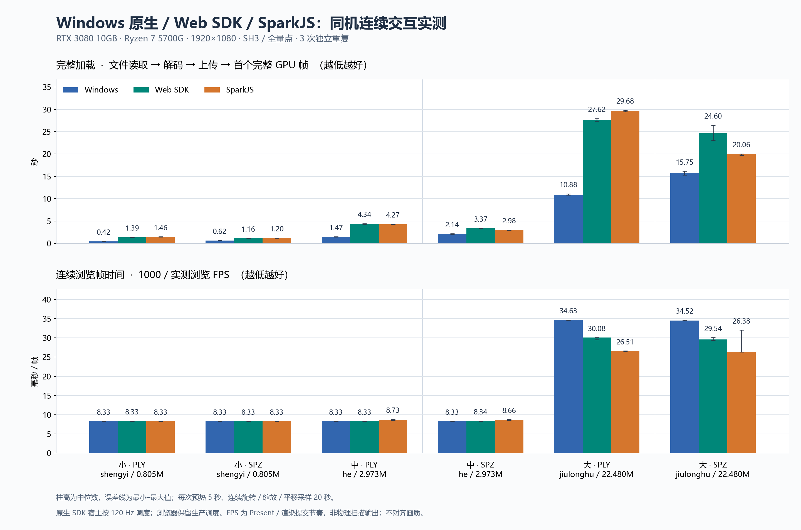

# Windows / Web / SparkJS 连续浏览对比

2026-10-06。本轮在 preview.3 SDK 与模板完成发布后，根据用户最新指示重新进行实测。仅增加基准工具与测量文档，不改变已发布 SDK 的代码或接口。

## 测量对象

| 引擎 | 实现与宿主 | 关键配置 |
| --- | --- | --- |
| Windows 原生 | 本仓库 C++20 model-io / render-core / CameraController；可见 HWND + DirectComposition，Release x64 | 全量点、SH3、stride=1；关闭自动内存缓解；宿主 120 Hz 调度 |
| Web SDK | 0.2.2-preview.3 对应源码；WebGPU，Edge 普通隔离测试目录 | auto/4 WASM 解码、adaptive GPU 排序、2 帧在途；保留生产 SDK 调度 |
| SparkJS | 锁定 `@sparkjsdev/spark` 2.3.1，Three.js 0.180.0，WebGL2，同版本 Edge | 全量点、SH3、关闭 LoD；保留异步排序和 autoUpdate |

Windows 测量直接消费公共底层 SDK，不包含 WinUI 控件、文件选择器、鼠标事件转换和协调器线程的额外开销；因此这是原生引擎宿主对比，不能宣称测得 Windows 桌面查看器 UI 的完整响应时间。浏览器同样使用 SDK 基准宿主，不测 React/Vue 界面重渲染成本；本轮为 Vite 开发基准页面消费对应 SDK 源码，并核验实际服务的模块与 WASM，不代表任意生产网站的端到端耗时。

机器：Ryzen 7 5700G、RTX 3080 10GB、32GB RAM、Windows 11 build 26200；NVIDIA 驱动 32.0.16.1692。系统桌面为 2560×1600、WMI 报告 119 Hz，按约 120 Hz 显示节奏测量；三引擎画布均固定为 1920×1080 物理像素。硬件原始记录见 [environment.json](environment.json)。浏览器完整版本来自各轮 `results.json`。

## 模型与方法

三组均选取同名 PLY/SPZ，而非任意凑齐六个不相关模型。小组 `shengyi_v1` 为 804,758 点，中组 `he_v1` 为 2,973,002 点，大组 `jiulonghu_v1` 为 22,480,361 点；全部 SH3。文件来自用户提供的 `zhishan` 目录，输入字节数与 SHA256 根据既有 38 模型 manifest 核验；真实 HTTP 响应也逐字节核验。模型文件不提交到仓库。

每个模型 / 格式 / 引擎独立运行 3 次，总计 54 次。每次新建进程或普通磁盘浏览器测试目录，预热 5 秒，采样至少 20 秒。GPU 工作严格串行，模型顺序在第二轮反向，浏览器引擎次序按模型交替。轨迹按墙钟时间计算，每 18 秒循环旋转、近距离缩放和平移；相同格式的三个引擎共用 Windows fit 得到的初始世界姿态，FOV 为 60°。初始姿态及其文件哈希在浏览器证据中记录。

具体轨迹为水平轨道角 `0.4 × sin(2πt/12)` 弧度，6–12 秒的距离倍率为 `0.7 + 0.3 × cos(2π(t−6)/6)`，12–18 秒的水平平移振幅为初始距离的 15%。预热与正式采样分别从 t=0 开始。本轮未加入俯仰、自由飞行或特定模型的室内近景路径；不同视点的屏幕覆盖和过度绘制可能改变性能，不能将本图当作所有手工镜头的保证。

PLY 和 SPZ 文件本身可能具有不同坐标朝向和量化包围盒。对应格式分别共用姿态，不假定 PLY 与 SPZ 的模型数值完全相同。Spark PLY 显示层采用既有基准的 X 轴 π 旋转，SPZ 保持原姿态。轨迹由 SDK 相机 API 驱动，没有手工鼠标回放的时序差异。

**完整加载时间**从发起文件读取 / 本机回环 HTTP 请求计到全量场景上传且首个完整 GPU 帧完成，包含解码、资源分配、上传与首次排序 / 渲染；引擎和图形设备创建在计时之外，WASM 首次初始化发生在加载内。Windows 使用 `first_frame_ms`，Web 与 Spark 使用 `loaded.firstFrameMs`。Web 另外记录设置共同参考姿态后完成帧的 `loaded.ms`，Spark 的 `loaded.ms` 还包含计时外 60 帧稳定过程，不能直接混用这两个字段。

这不是纯解码 kernel 比较，也不是磁盘冷缓存测量。计时外的输入哈希验证会预热操作系统文件缓存；浏览器测试目录是新的，HTTP 没有复用上一轮浏览器缓存。原生本地文件与 Web 回环 URL 的 I/O 路径、WASM / helper 初始化、验证机制并不相同。Web 首帧使用 SDK 自身 fit，随后在交互计时外切到共同参考姿态；连续浏览的姿态一致。

**连续浏览帧时间**定义为 `1000 / 实测浏览 FPS`，单位 ms/帧，包含实际调度、投影、排序、绘制及其重叠和背压。不是 GPU 时间戳的纯 draw 阶段耗时。Windows 统计 DXGI `GetLastPresentCount` 的增量，独立记录 render 调用数；浏览器统计真正的 SDK 渲染提交，而非输入 rAF 回调数。原生 JSON 历史字段名为 `acceptedPresents`，其证据来源是 DXGI 计数器，不是逐次 Present HRESULT 钩子或物理扫描输出。本轮全部原生窗口中计数与 render 调用数一致。没有逐帧 `gl.finish` / GPU fence 等待人为串行化。浏览器 WebGPU 自身保持 2 帧在途上限，Spark 保持正常 WebGL 调度。

这些指标描述可见宿主连续浏览的呈现 / 提交节奏，不是 PresentMon 或显示器物理扫描输出 FPS。达到约 120 FPS 表示本次宿主 / 浏览器调度上限附近，不能据此排列其无限制最高吞吐。用户要求本轮暂不关注画质，故保留各引擎的渲染阈值差异；全量点和 SH3 不等于像素级质量相同。

## 结果

54 次测量全部成功，全部保留原始点数与 SH3，未触发降点 / LoD / 内存缓解。浏览器为 Edge 154.0.4258.53，全部 18 个 Web 加载配置实际使用 pthreads / 4 线程，无 single 回退。三轮实际服务模块、WASM、Spark 源码与相机文件哈希一致。



同一张图采用两个面板，分别显示秒和毫秒，避免将不同单位混在一个纵轴上。柱高为 3 次独立重复的中位数，误差线为最小–最大值；不是置信区间。图中帧时间由每轮完整 20 秒窗口的 FPS 取倒数后再取中位数，不是单帧间隔中位数。

可下载 [PNG](three-engine-comparison.png)、[可编辑 SVG](three-engine-comparison.svg)、[PDF](three-engine-comparison.pdf)、[汇总 CSV](summary.csv)、[54 次原始窗口指标 CSV](runs.csv)、[JSON](summary.json)和 [浏览器全部逐帧原始数据 ZIP](raw-browser-samples.zip)。ZIP 保留 36 个原始 JSON 的相对目录和逐字节内容；在本目录解压后与 results 的 rawFile 路径一致。将原始逐帧 JSON 归档，避免超过百万行的序列化数据掩盖代码审查。

### 完整加载时间（秒，中位数，越低越好）

| 模型 / 格式 | 输入 MiB | Windows | Web SDK | SparkJS |
| --- | ---: | ---: | ---: | ---: |
| 小 shengyi · PLY | 181.13 | 0.425 | 1.387 | 1.460 |
| 小 shengyi · SPZ | 17.10 | 0.615 | 1.161 | 1.203 |
| 中 he · PLY | 669.13 | 1.471 | 4.341 | 4.270 |
| 中 he · SPZ | 48.70 | 2.142 | 3.369 | 2.981 |
| 大 jiulonghu · PLY | 5059.59 | 10.884 | 27.615 | 29.679 |
| 大 jiulonghu · SPZ | 477.56 | 15.746 | 24.600 | 20.056 |

### 连续浏览帧时间（ms/帧，中位数，括号为 FPS）

| 模型 / 格式 | Windows | Web SDK | SparkJS |
| --- | ---: | ---: | ---: |
| 小 shengyi · PLY | 8.33（120.04） | 8.33（120.00） | 8.33（120.00） |
| 小 shengyi · SPZ | 8.33（120.04） | 8.33（120.00） | 8.33（120.00） |
| 中 he · PLY | 8.33（120.04） | 8.33（120.00） | 8.73（114.58） |
| 中 he · SPZ | 8.33（120.04） | 8.34（119.95） | 8.66（115.50） |
| 大 jiulonghu · PLY | 34.63（28.87） | 30.08（33.25） | 26.51（37.72） |
| 大 jiulonghu · SPZ | 34.52（28.97） | 29.54（33.85） | 26.38（37.91） |

原生约 120.04 FPS 的微小超额来自窗口首尾计数与时间边界，不代表超过浏览器刷新上限的实质优势。

### 低帧率区间（1% low FPS，中位数，越高越好）

这里的 1% low 为每轮最慢 ceil(帧区间数 × 1%) 个帧区间的平均值取倒数，然后对 3 轮取中位数；不等同于第 1 百分位 FPS。

| 模型 / 格式 | Windows | Web SDK | SparkJS |
| --- | ---: | ---: | ---: |
| 小 shengyi · PLY | 107.85 | 116.54 | 94.61 |
| 小 shengyi · SPZ | 108.61 | 115.99 | 96.43 |
| 中 he · PLY | 108.91 | 115.02 | 52.98 |
| 中 he · SPZ | 107.40 | 110.33 | 52.52 |
| 大 jiulonghu · PLY | 27.92 | 23.74 | 9.76 |
| 大 jiulonghu · SPZ | 28.31 | 23.89 | 9.83 |

### 结果解释

- 原生 Windows 在六组完整加载中均最快。由于本地文件与回环 HTTP、helper 与 WASM、资源验证机制不同，该结论是宿主全流程结果，不能直接推导某个纯解码算法的倍数。
- 小模型平均帧率均达到约 120 FPS；中模型 Web / Windows 达到本次采样上限附近，Spark 约 115 FPS。小模型不能由本图判断无限制吞吐排名。
- 大模型平均 FPS 为 Spark > Web > Windows。Web 相比 Spark 的帧时间，PLY 多约 13.45%、SPZ 多约 11.99%；相比 Windows 则分别少约 13.16%、14.41%。三者仍有不同质量阈值，本轮未做像素质量匹配。
- 大模型的低帧率区间为 Windows > Web > Spark。Web 1% low 约 23.7–23.9 FPS，Spark 约 9.8 FPS；原生约 27.9–28.3 FPS。Spark 平均值更高并不表示其所有浏览区间更平稳。
- Web 加载并非在所有格式中落后 Spark：大 PLY 约快 6.95%，大 SPZ 约慢 22.65%；小模型接近，中 SPZ 也仍落后。当前更值得继续关注的是大 SPZ 全流程加载与大模型平均浏览帧时间，同时保留已经较好的低帧率区间表现。

本轮只有 3 次独立重复，不作统计显著性或跨设备保证。尤其 Spark 大 SPZ 的平均 FPS 范围为约 31.24–37.94，主图误差线保留了这次波动，不能只选择最快一次作结论。这是当前默认组合的对比，不是 single/parallel 或 strict/adaptive 的消融实验，不能将所有差异单独归因于多线程 WASM 或自适应排序。

计时窗口内没有捕获到模型 / 引擎运行错误。Spark 在计时结束后的 dispose 阶段存在 `Worker terminate`、`No target` 异步拒绝，开发服务器收尾日志可见；基准监听器按原有设计在 disposing 阶段不计入采样错误。Spark 还发出 signed/unsigned shader 编译告警，原始 JSON 的 warnings 保留。上述收尾行为不在加载 / 浏览计时内，不据此宣称 Spark 生命周期验证通过；相关时间摘录见 [diagnostics.md](diagnostics.md)。临时浏览器目录和本轮 Vite 服务均已关闭。

## 可复现与审查

[protocol.md](protocol.md) 是测量前制定的协议。原生可见宿主源码为 [windows-interaction.cpp](../../../bench/windows-interaction.cpp)，驱动为 [measure-interaction.py](../../../bench/measure-interaction.py)；浏览器批次驱动为 [measure-browser-interaction.py](../../../bench/measure-browser-interaction.py)，图表和严格汇总校验为 [plot-three-engine.py](../../../bench/plot-three-engine.py)。

执行顺序：

```powershell
cmake --build out/cmake --config Release --target Native3DGSViewer.InteractionBench --parallel 8
python bench/measure-interaction.py
# 另一个终端启动本地服务，完成原生测量后才启动浏览器采样
Set-Location ForWeb
$env:GS_MODEL_ROOT = 'C:\Users\21544\Desktop\zhishan'
$env:GS_CROSS_ORIGIN_ISOLATED = '1'
pnpm dev --port 5187 --strictPort
# 仓库根目录
python bench/measure-browser-interaction.py
python bench/plot-three-engine.py
```

两个驱动使用本机模型路径与固定测量目录，异机执行前需调整路径；浏览器驱动拒绝未完成的原生结果。不要同时运行两个 GPU 驱动，不要在采样期间修改 Web SDK / benchmark app / Vite 配置以免 HMR 污染测量。若重新运行，完整执行对应批次再汇总；失败结果保留为失败，不能把降点或单独截取片段作为成功结果。

`windows-results.json` 记录原生二进制、宿主源码及 SDK 基础提交；`web-repeat-{0,1,2}/results.json` 记录模型、服务实际交付的模块 / WASM / Spark 源码匹配、相机文件哈希、浏览器版本、配置、错误与可见性。原生逐帧 `.log` 和浏览器逐帧 `.json` 保留每次采样；PNG 是计时外的初始可见场景证据。

基准工具提交发生在测量期间，部分轮次记录的 Git HEAD 因此不同；引擎、浏览器应用、WASM 与 Spark 源码未修改，也没有触发 HMR。汇总以逐个文件的 SHA256 跨轮一致性核验实际运行代码，不能仅把 Git HEAD 字符串当作引擎是否相同的判断。

实测原生 C++ / 二进制未在测量中修改。原生首版 Python 驱动的成功运行均为普通非 `-O` 模式，无失败，原样保存为 [windows-measured-driver.py](windows-measured-driver.py)；浏览器批次首版驱动保存为 [browser-measured-driver.py](browser-measured-driver.py)。OCR 后改进驱动的优化模式校验、失败持久化和超时输出保存，不改变成功运行的计时 / 轨迹。原生辅助 1% low 在汇总时从逐帧日志按 ceil 重新计算，与浏览器最慢 1% 区间取法统一；主图加载时间与 FPS 不变。审查和故障验证见 [review.md](review.md)。

初次先导运行曾因 Windows stdout 的双 CR 导致解析失败；已修复解析，失败证据为 `windows-pilot-parser-failure.json`，`complete=false`，不参与 54 次结果汇总。
